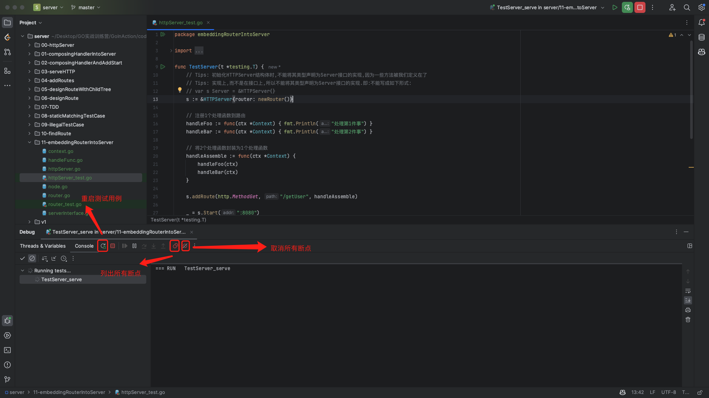

# 12. 路由树-静态匹配之集成Server

## PART1. 实现`HTTPServer.serve()`方法

之前的课程中说过,该方法的职责为:**查找路由树并执行命中的业务逻辑**.我们也已经实现了`router.findRoute()`.

`httpServer.go`:此处只写做了修改的方法,其他没有改动的方法就不贴了,看着太乱

- 实现`httpServer.serve()`方法:

```go
// serve 查找路由树并执行命中的业务逻辑
func (s *HTTPServer) serve(ctx *Context) {
	method := ctx.Req.Method
	path := ctx.Req.URL.Path
	targetNode, ok := s.findRoute(method, path)
	// 没有在路由树中找到对应的路由节点 或 找到了路由节点的处理函数为空(即NPE:none pointer exception 的问题)
	// 则返回404
	if !ok || targetNode.HandleFunc == nil {
		ctx.Resp.WriteHeader(http.StatusNotFound)
		// 此处确实会报错 但是作为一个WEB框架 遇上了这种错误也没有特别好的处理办法
		// 最多只能是落个日志
		_, _ = ctx.Resp.Write([]byte("Not Found"))
		return
	}

	// 执行路由节点的处理函数
	targetNode.HandleFunc(*ctx)
}
```

- 删除`http. ServeHTTP()`方法中的`panic()`

```go
// ServeHTTP WEB框架入口
func (s *HTTPServer) ServeHTTP(w http.ResponseWriter, r *http.Request) {
	// 构建上下文
	ctx := &Context{
		Req:  r,
		Resp: w,
	}

	// 查找路由树并执行命中的业务逻辑
	s.serve(ctx)
}
```

## PART2. 修改`HandleFunc`类型的入参

### 2.1 修改入参类型为`*Context`

之前入参类型为`Context`

`handleFunc.go`:

```go
type HandleFunc func(ctx *Context)
```

### 2.2 修改其他受影响的地方

此处只列出受影响的方法或文件(文件基本上都是测试文件),读者自行比对修改即可

- `HTTPServer.serve()`
- `httpServer_test.go`
- `router_test.go`

## PART3. 测试

TODO:文件开头的那句`go:build e2e`的含义要去查

在`httpServer_test.go`新创建一个测试函数:

`httpServer_test.go`:

```go
func TestServer_serve(t *testing.T) {
	s := NewHTTPServer()
	handleFunc := func(ctx *Context) {
		// 直接调用http.ResponseWriter的Write方法时 默认响应码为200
		ctx.Resp.Write([]byte("hello order detail"))
	}
	s.addRoute(http.MethodGet, "/order/detail", handleFunc)
	_ = s.Start(":8081")
}
```

其实这里还有一个问题:如果将`s := NewHTTPServer()`更改为`s := &HTTPServer{}`,就会因为`router`为空而触发panic.



## PART4. 修改`HTTPServer`的成员属性

将`*router`修改为`router`

修改原因:就是为了和PPT上的统一一下.这里我看过,GIN的`Engine`是组合了`RouterGroup`;而Beego的`HttpServer`则是组合了`*ControllerRegister`.倒不是大家都用非指针类型

- `httpServer.go`:

```go
// HTTPServer HTTP服务器
type HTTPServer struct {
	router
}
```

- `router.go`:

```go
// newRouter 创建路由森林
func newRouter() router {
	return router{
		trees: map[string]*node{},
	}
}
```

- `router_test.go`中也有修改


## 附录

### 需要课后尝试的内容

将`HttpServer`结构体修改为私有

这个修改的目的在于:强迫使用者必须使用`NewHttpServer()`函数来创建`HttpServer`结构体的实例.否则他自己直接`s := &HTTPServer{}`触发panic.

### 何时将成员属性类型定义为指针类型?何时将成员属性类型定义为结构体类型?

以HTTPServer为例:

```go
type HTTPServer struct {
	*router
}
```

#### case1. 使用者用`&HTTPServer`的情况

我们期望使用者用`HTTPServer`的指针,因此其成员属性`router`是不是指针就不重要了,都行

这里我试过:

```go
type HTTPServer struct {
	*router
}

s := &HTTPServer{}
if s.router == nil {
	fmt.Printf("s.router is nil\n")
}
```

则打印:`s.router is nil`

但如果改为:

```
type HTTPServer struct {
	router
}

s := &HTTPServer{}
fmt.Printf("%p\n", &s.router)
```

则打印:`0xc00011a050`.可以看到已经给`router`分配了内存

#### case2. 使用者用`HTTPServer`的情况

```go
type HTTPServer struct {
	*router
}

s := HTTPServer{}
if s.router == nil {
	fmt.Printf("s.router is nil\n")
}
```

则打印:`s.router is nil`


```go
type HTTPServer struct {
	router
}

s := HTTPServer{}
fmt.Printf("%p\n", &s.router)
```

则打印:`0xc0000aa050`.同样已经给`router`分配了内存.但是!这种方式要考虑值传递的问题.不要忘记GO语言中所有的传递都是值传递!

结论:**拿不准就用指针!**