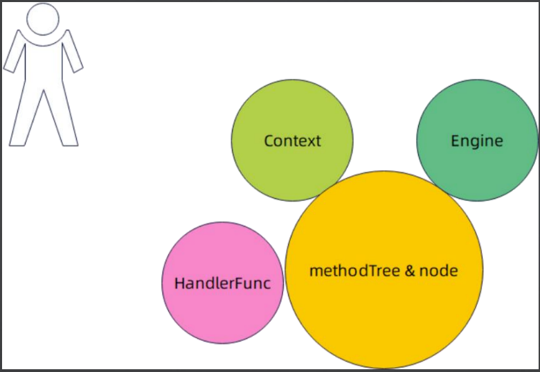

# 3. Web框架概览-GIN框架分析

## PART1. 基本使用

定义Controller:

```GO
package gin

import "github.com/gin-gonic/gin"

type UserController struct {
}

func (c *UserController) GetUser(ctx *gin.Context) {
	ctx.String(200, "hello, world")
}
```

**注意:此时我们自定义的Controller并不像使用Beego时,组合了框架内置的Controller的**

使用Controller:

```GO
package gin

import (
	"github.com/gin-gonic/gin"
	"net/http"
	"testing"
)

func TestUserController_GetUser(t *testing.T) {
	g := gin.Default()
	ctrl := &UserController{}
	g.GET("/user", ctrl.GetUser)
	g.POST("/user", func(ctx *gin.Context) {
		ctx.String(http.StatusOK, "hello %s", "world")
	})

	g.GET("/static", func(context *gin.Context) {
		// 读文件
		// 写响应
	})
	_ = g.Run(":8082")
}
```

注意:此处注册路由使用了2种方式.

方式1:直接将Controller上的方法注册到Server上,例如`g.GET("/user", ctrl.GetUser)`

方式2:将一个匿名函数注册到Server上,例如:

```GO
g.POST("/user", func(ctx *gin.Context) {
	ctx.String(http.StatusOK, "hello %s", "world")
})
```

从使用上就可以看出,GIN没有像Beego一样对使用者做出一个基本MVC模型的假设(或者可以说是要求我认为).

## PART2. IRoutes接口

[IRoutes](https://github.com/gin-gonic/gin/blob/master/routergroup.go#L33)接口是GIN的核心接口,提供了注册路由的抽象.提及到这些功能,那么GIN的IRoutes接口就很像Beego的[ControllerRegister](https://github.com/beego/beego/blob/develop/server/web/router.go#L160)接口了.

实际上GIN的[`Engine`](https://github.com/gin-gonic/gin/blob/master/gin.go#L84)结构体就是该接口的实现.

```GO
// IRoutes defines all router handle interface.
type IRoutes interface {
	Use(...HandlerFunc) IRoutes

	Handle(string, string, ...HandlerFunc) IRoutes
	Any(string, ...HandlerFunc) IRoutes
	GET(string, ...HandlerFunc) IRoutes
	POST(string, ...HandlerFunc) IRoutes
	DELETE(string, ...HandlerFunc) IRoutes
	PATCH(string, ...HandlerFunc) IRoutes
	PUT(string, ...HandlerFunc) IRoutes
	OPTIONS(string, ...HandlerFunc) IRoutes
	HEAD(string, ...HandlerFunc) IRoutes
	Match([]string, string, ...HandlerFunc) IRoutes

	StaticFile(string, string) IRoutes
	StaticFileFS(string, string, http.FileSystem) IRoutes
	Static(string, string) IRoutes
	StaticFS(string, http.FileSystem) IRoutes
}
```

- `Use()`方法:提供了用户**接入自定义逻辑的能力**,通常也被看做是插件机制.和后边要讲的AOP方案本质上是相同的
- 处理静态文件相关的行为
	- `StaticFile()`方法
	- `StaticFileFS()`方法
	- `Static()`方法
	- `StaticFS()`方法
- `Handle()`方法:处理注册路由的行为

此时我们先不管其他几个HTTP动词的方法,先来看一下我们注册一个路由时(例如上文例子中的`g.GET()`/`g.POST()`)的调用链:

`Engine.GET()`源码:

```GO
// GET is a shortcut for router.Handle("GET", path, handle).
func (group *RouterGroup) GET(relativePath string, handlers ...HandlerFunc) IRoutes {
	return group.handle(http.MethodGet, relativePath, handlers)
}
```

`Engine.POST()`源码:

```GO
// POST is a shortcut for router.Handle("POST", path, handle).
func (group *RouterGroup) POST(relativePath string, handlers ...HandlerFunc) IRoutes {
	return group.handle(http.MethodPost, relativePath, handlers)
}
```

很明显它们调用的都是`group.handle()`方法.我们再来看一下RouterGroup(实际上也是IRoutes的实现)的`Handle()`方法:

```GO
func (group *RouterGroup) Handle(httpMethod, relativePath string, handlers ...HandlerFunc) IRoutes {
	if matched := regEnLetter.MatchString(httpMethod); !matched {
		panic("http method " + httpMethod + " is not valid")
	}
	return group.handle(httpMethod, relativePath, handlers)
}
```

破案了,结论:接口`IRoutes`中的HTTP动词相关的方法(例如`GET()`/`POST()`等)本质上和调用其`Handle()`方法的底层是完全相同的,都是调用的`RouterGroup.handle()`方法.

一种观点认为:`IRoutes`接口作为核心接口,是没有必要在其定义中保留HTTP动词相关的方法,仅有`Handle()`方法即可.

抱持上述观点的人也同样认为处理静态文件相关的方法也不需要定义在核心接口`IRoutes`中.可以像上述例子中的如下代码:

```GO
g.GET("/static", func(context *gin.Context) {
	// 读文件
	// 写响应
})
```

的做法,框架只需提供具有"读文件"和"写响应"的方法,让使用者自行将该方法注册到路由上即可.没有必要将处理静态文件相关的方法定义在核心接口`IRoutes`中.

我个人认为:HTTP动词相关的方法被定义出来,可能更多的是为了提升使用者写出的代码可读性.所以其定义确实不必放在核心接口中.

再次强调:GIN是没有设计Controller的抽象的.这方面讲师和GIN框架设计者的意见比较一致,他们认为:**是否使用MVC模式是交由使用者决定的,而非一个中间件设计者需要考虑的**.

Beego的设计限制(或者可以说强制要求)使用者组合其内置的Controller,这样的设计会侵入框架使用者的代码.而GIN的设计则将"是否使用MVC模式"的决定权交由使用者决定.

由此引申出的一个问题是:**MVC模式究竟是一个WEB框架本身就应该具有的形式,还是使用者组织路由的形式之一?**讲师抱持的是后者的观点,即:**MVC是使用者组织路由的形式之一**,使用者同样可以像上述例子中,使用匿名函数来完成路由注册.

## PART3. Engine的实现

### 3.1 基本概念

[Engine](https://github.com/gin-gonic/gin/blob/master/gin.go#L84)可以看做是Beego中HttpServer和ControllerRegister的结合体.

```GO
// Engine is the framework's instance, it contains the muxer, middleware and configuration settings.
// Create an instance of Engine, by using New() or Default()
type Engine struct {
	RouterGroup

	RedirectTrailingSlash bool

	RedirectFixedPath bool

	HandleMethodNotAllowed bool

	ForwardedByClientIP bool

	AppEngine bool

	UseRawPath bool

	UnescapePathValues bool

	RemoveExtraSlash bool

	RemoteIPHeaders []string

	TrustedPlatform string

	MaxMultipartMemory int64

	UseH2C bool

	ContextWithFallback bool

	delims           render.Delims
	secureJSONPrefix string
	HTMLRender       render.HTMLRender
	FuncMap          template.FuncMap
	allNoRoute       HandlersChain
	allNoMethod      HandlersChain
	noRoute          HandlersChain
	noMethod         HandlersChain
	pool             sync.Pool
	trees            methodTrees
	maxParams        uint16
	maxSections      uint16
	trustedProxies   []string
	trustedCIDRs     []*net.IPNet
}
```

上文已经说过,结构体`RouterGroup`是接口`IRoutes`的实现.可以看到`Engine`组合了`RouterGroup`,自然`Engine`也是接口`IRoutes`的实现.因此其具有Beego中ControllerRegister的部分功能.

### 3.2 Engine是接口`http.Handler`的实现

`Engine`本身可以作为一个Handler传递到http包,用于启动服务器,示例如下:

```GO
package gin

import (
	"github.com/gin-gonic/gin"
	"net/http"
)

func UseEngineAsHandler() {
	g := gin.Default()
	http.ListenAndServe(":", g)
}
```

这是因为`Engine`实现了接口`http.Handler`:

```GO
// ServeHTTP conforms to the http.Handler interface.
func (engine *Engine) ServeHTTP(w http.ResponseWriter, req *http.Request) {
	c := engine.pool.Get().(*Context)
	c.writermem.reset(w)
	c.Request = req
	c.reset()

	engine.handleHTTPRequest(c)

	engine.pool.Put(c)
}
```

### 3.3 Engine中的`tree`字段--`methodTrees`和`methodTree`

`Engine`的路由树功能本质上是依赖于[`methodTree`](https://github.com/gin-gonic/gin/blob/master/gin.go#L166)的.其定义如下:

```GO
type methodTrees []methodTree
```

1个HTTP动词有1棵树,这些树构成了一片"森林",即`methodTrees`.而`methodTree`才是真实的路由树:

```GO
type methodTree struct {
	method string
	root   *node
}
```

### 3.4 HandlerFunc和HandlersChain

`HandlerFunc`定义了核心抽象——处理逻辑.在默认情况下,它代表了注册路由的业务代码.

```GO
// HandlerFunc defines the handler used by gin middleware as return value.
type HandlerFunc func(*Context)
```

简单理解`HandlerFunc`就是你的业务代码.在第一部分的例子中,匿名函数和`ctrl.GetUser`其实就是`HandlerFunc`

可以将多个`HandlerFunc`整理成1个`HandlersChain`,构造成责任链模式:

```GO
// HandlersChain defines a HandlerFunc slice.
type HandlersChain []HandlerFunc
```


上图中的`HandlerFunc1`、`HandlerFunc2`、`HandlerFunc3`是一些其他操作(我个人理解类似Middleware),你写的业务逻辑是`HandlerFunc4`,放在了最后执行.

核心:当路由匹配命中之后,并非直接命中到你的业务逻辑代码,而是匹配到了一条责任链,在这条责任链上,先执行一些中间件,最后才执行你的业务逻辑代码.

TODO:问题:如果我想在我的业务逻辑代码之后再执行某些操作(例如记录我的业务逻辑代码执行的时长),是不是这个模式就不适合了?

## PART4. Context抽象

[Context](https://github.com/gin-gonic/gin/blob/master/context.go#L51)也是代表了执行的上下文,提供了丰富的API:

```GO
// Context is the most important part of gin. It allows us to pass variables between middleware,
// manage the flow, validate the JSON of a request and render a JSON response for example.
type Context struct {
	writermem responseWriter
	Request   *http.Request
	Writer    ResponseWriter

	Params   Params
	handlers HandlersChain
	index    int8
	fullPath string

	engine       *Engine
	params       *Params
	skippedNodes *[]skippedNode

	// This mutex protects Keys map.
	mu sync.RWMutex

	// Keys is a key/value pair exclusively for the context of each request.
	Keys map[string]any

	// Errors is a list of errors attached to all the handlers/middlewares who used this context.
	Errors errorMsgs

	// Accepted defines a list of manually accepted formats for content negotiation.
	Accepted []string

	// queryCache caches the query result from c.Request.URL.Query().
	queryCache url.Values

	// formCache caches c.Request.PostForm, which contains the parsed form data from POST, PATCH,
	// or PUT body parameters.
	formCache url.Values

	// SameSite allows a server to define a cookie attribute making it impossible for
	// the browser to send this cookie along with cross-site requests.
	sameSite http.SameSite
}
```

- 处理请求的API:代表的是以Get和Bind为前缀的方法
- 处理响应的API:例如返回JSON或者XML响应的方法
- 渲染页面的API:如HTML方法


**这个结构体的API要多看!**

## PART5. 核心抽象总结



- `methodTree`&`node`:表示了一棵路由树
- `Engine`:Beego中HttpServer和ControllerRegister的结合体,完成了路由匹配和服务启动的功能
- `Context`:和Beego一样作为每个请求的上下文使用
- `HandlerFunc`:Beego的`ControllerInterface`中也有一个`HandlerFunc()`方法