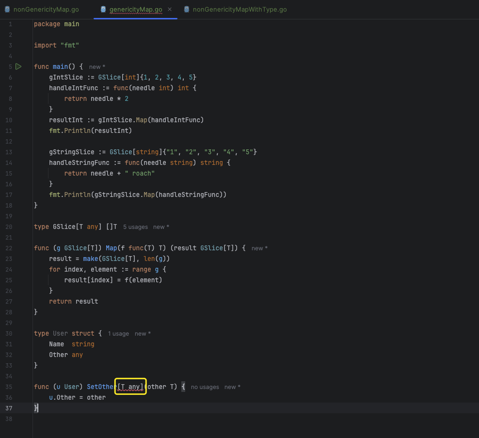

# 1. 泛型

## PART1. 一个非泛型示例

在介绍什么是泛型之前,先来看一个非泛型书写的示例:求2个整数中的最小值.

```go
package main

import "fmt"

func main() {
	fmt.Printf("minInt(42, 32) = %d\n", minInt(42, 32))
}

// minInt 返回2个整型中较小的一个
func minInt(a, b int) int {
	if a < b {
		return a
	}
	return b
}
```

那么问题来了:**如果还需要求两个`float32`、`float64`等类型的最小值该怎么办?**

目前来看还得定义额外的针对这些类型的、求最小值的方法,才能满足需求.**一则这些方法的实现都一样,重复度很高;再则一旦未来需求有所变更(比如从求2个数的最小值修改为求2个数的最大值),所有方法都需要重新修改一遍,不利于维护**.

## PART2. 使用泛型重构示例

实际上我们的期望是:**声明一个通用函数,可以满足求所有数字类型求最小值的需求**.

实际上这些方法之间的区别仅有参数类型和返回值类型.**如果可以声明一个类型参数,让参数的类型由外部调用的实参决定,那么就能实现这个通用的函数**.

```go
package main

import (
	"fmt"
	"reflect"
)

func main() {
	value := minValue[float64](-1, 2.4)
	fmt.Printf("minValue(%v, %v) = %v type = %v \n", -1, 2.4, value, reflect.TypeOf(value))
}

// minValue 返回两个值中较小的值 这个值的类型可能为 int/float32/float64
func minValue[Value int | float32 | float64](a, b Value) Value {
	if a < b {
		return a
	}
	return b
}
```

运行结果:

```
(base) yanglei@bogon 2-genericDemo % go run genericDemo.go
minValue(-1, 2.4) = -1 type = float64 
```

语法上而言,在`函数名`和`形参列表`之间,多了一个`[]`,`[]`用于声明类型参数.类型参数用于**约束**在实际调用`minValue()`函数时,可以被允许传递给该函数的实参类型.注意这里用`|`符号表示"或",也就是并集的意思.

在这个示例中,我们定义允许`int`、`float32`、`float64`这3种类型的实参.

## PART3. 类型推导

注意在上个示例中,我们调用`minValue()`函数的代码:`minValue[float64](-1, 2.4)`.可以看到我们调用时显式传递了具体的类型,使用`[]`传递,这样做的目的在于**确定函数调用时具体参数的类型**.

但实际上这种写法会导致编写代码时非常繁琐,代码的可读性也不强.但是这个显式传递的具体类型是可以去掉的:

```go
package main

import (
	"fmt"
	"reflect"
)

func main() {
	value := minValue(-1, 2.4)
	fmt.Printf("minValue(%v, %v) = %v type = %v \n", -1, 2.4, value, reflect.TypeOf(value))
}

// minValue 返回两个值中较小的值 这个值的类型可能为 int/float32/float64
func minValue[Value int | float32 | float64](a, b Value) Value {
	if a < b {
		return a
	}
	return b
}
```

运行结果:

```
(base) yanglei@bogon 3-typeInference % go run typeInference.go 
minValue(-1, 2.4) = -1 type = float64 
```

可以看到,调用一个泛型函数的代码,和调用一个非泛型函数的代码是完全相同的.

## PART4. 自定义类型约束

再来看`minValue()`函数的实现:

```go
// minValue 返回两个值中较小的值 这个值的类型可能为 int/float32/float64
func minValue[Value int | float32 | float64](a, b Value) Value {
	if a < b {
		return a
	}
	return b
}
```

在这段代码中,`[Value int | float32 | float64]`定义在`minValue()`函数上,这就意味着如果还有一个求最大值的`maxValue()`函数,则这个`maxValue()`函数上还需要再定义一次类型约束.如果要是有个专门用于定义类型约束的地方就好了.

我们能想到的事情,GO语言的设计自然也能想到:

```go
package main

import (
	"fmt"
	"reflect"
)

// Number 自定义的类型约束 类型可以为int/float32/float64
type Number interface {
	int | float32 | float64
}

func main() {
	value := minValue(-1, 2.4)
	fmt.Printf("minValue(%v, %v) = %v type = %v \n", -1, 2.4, value, reflect.TypeOf(value))
}

// minValue 返回两个值中较小的值 这个值的类型可能为 int/float32/float64
func minValue[Value Number](a, b Value) Value {
	if a < b {
		return a
	}
	return b
}
```

## PART5. 内置的类型约束

为了使用方便,GO内置了一些类型约束,这些约束在GO1.18Beta时还在标准库中,正式发布时移动到了[`golang.org/x/exp/constraints`](https://pkg.go.dev/golang.org/x/exp/constraints)包中.因此我们需要先导入这个包,才能使用这些类型约束.

在我们上述示例中,我们定义的类型约束`Number`其实可以换成`constraints.Ordered`:

```go
package main

import (
	"fmt"
	"golang.org/x/exp/constraints"
	"reflect"
)

func main() {
	value := minValue(-1, 2.4)
	fmt.Printf("minValue(%v, %v) = %v type = %v \n", -1, 2.4, value, reflect.TypeOf(value))
}

// minValue 返回两个值中较小的值 这个值的类型可能为 int/float32/float64
func minValue[Value constraints.Ordered](a, b Value) Value {
	if a < b {
		return a
	}
	return b
}
```

为什么可以呢?来看官方对[`constraints.Ordered`](https://cs.opensource.google/go/x/exp/+/9a3e6036:constraints/constraints.go;l=48)类型约束的描述:

`Ordered is a constraint that permits any ordered type: any type that supports the operators < <= >= >.`

也就是说,`constraints.Ordered`类型约束是一个允许任何有序类型的约束.支持`<`、`<=`、`>=`、`>`操作符

### 5.1 `constraints.Signed`

[`constraints.Signed`](https://cs.opensource.google/go/x/exp/+/9a3e6036:constraints/constraints.go;l=12)是一个**有符号整型**的约束.其定义如下:

```go
type Signed interface {
	~int | ~int8 | ~int16 | ~int32 | ~int64
}
```

其实就是所有有符号整型的并集.注意这里的`~`,表示**该约束对派生类型也生效**

例:

```go
package main

import (
	"fmt"
	"golang.org/x/exp/constraints"
	"reflect"
)

// MyInt int的派生类型
type MyInt int

func main() {
	a := MyInt(1)
	b := MyInt(2)
	value := minValue(a, b)
	fmt.Printf("minValue(%v, %v) = %v type = %v \n", a, b, value, reflect.TypeOf(value))
}

// minValue 返回两个值中较小的值 这个值的类型可能为 int/float32/float64
func minValue[Value constraints.Signed](a, b Value) Value {
	if a < b {
		return a
	}
	return b
}
```

运行结果:

```
(base) yanglei@bogon 6-constraintsSigned % go run constraintsSigned.go 
minValue(1, 2) = 1 type = main.MyInt 
```

### 5.2 `constraints.Unsigned`

[`constraints.Unsigned`](https://cs.opensource.google/go/x/exp/+/9a3e6036:constraints/constraints.go;l=19)表示**无符号整型约束**,其定义如下:

```go
type Unsigned interface {
	~uint | ~uint8 | ~uint16 | ~uint32 | ~uint64 | ~uintptr
}
```

### 5.3 `constraints.Integer`

[`constraints.Integer`](https://cs.opensource.google/go/x/exp/+/9a3e6036:constraints/constraints.go;l=26)表示**整型约束**,这个约束实际上就是把`constraints.Signed`和`constraints.Unsigned`组合起来了:

```go
type Integer interface {
	Signed | Unsigned
}
```

### 5.4 `constraints.Float`

[`constraints.Float`](https://cs.opensource.google/go/x/exp/+/9a3e6036:constraints/constraints.go;l=33)表示**浮点型约束**,其实就是把`float32`和`float64`组合起来了:

```go
type Float interface {
	~float32 | ~float64
}
```

### 5.5 `constraints.Ordered`

[`constraints.Ordered`](https://cs.opensource.google/go/x/exp/+/9a3e6036:constraints/constraints.go;l=48)表示**任何有序类型**的约束,其实就是组合了`constraints.Integer`和`constraints.Float`还有`string`类型:

```go
type Ordered interface {
	Integer | Float | ~string
}
```

这里多了一个`string`是因为`string`也是有序的(即:支持`<`、`<=`、`>=`、`>`操作符)

### 5.6 `any`和`comparable`

[`any`](https://github.com/golang/go/blob/master/src/builtin/builtin.go#L97)是空接口的别名,表示任意类型:

```go
// any is an alias for interface{} and is equivalent to interface{} in all ways.
type any = interface{}
```

[`comparable`](https://github.com/golang/go/blob/master/src/builtin/builtin.go#L104)是可比较的接口,用于约束map中键的类型(若要在泛型中定义一个map,则其键必须是可比较的)

例:

```go
package main

import "fmt"

func main() {
	// 以string类型为key的map
	stringSet := NewSet[string, bool]()
	Add(stringSet, "apple", true)
	Add(stringSet, "orange", false)
	fmt.Printf("stringSet = %v\n", stringSet)

	// 以int类型为key的map
	intSet := NewSet[int, string]()
	Add(intSet, 1, "one")
	Add(intSet, 2, "two")
	fmt.Printf("intSet = %v\n", intSet)
}

// MySet 泛型map类型 要求其key必须是可比较的
type MySet[Key comparable, Value any] map[Key]Value

// NewSet 创建一个泛型map
func NewSet[Key comparable, Value any]() MySet[Key, Value] {
	return make(MySet[Key, Value])
}

// Add 向泛型map中添加元素
func Add[Key comparable, Value any](set MySet[Key, Value], key Key, value Value) {
	set[key] = value
}
```

## PART6. 函数式编程

### 6.1 `map()`

在JavaScript中,该函数说明如下:**`map()`函数创建一个新数组,这个新数组由原数组中的每个元素都调用一次提供的函数后的返回值组成**.

GO中常用的则是slice,这里我们用slice来实现.我们要实现的逻辑是:

定义一个泛型函数,该函数至少有2个参数:

- 原始slice
- 对slice中的元素进行处理的函数

#### 6.1.1 非泛型实现

先来实现一个非泛型版本的`map()`:

```go
package main

import "fmt"

func main() {
	s := []int{1, 2, 3, 4, 5}
	handleFunc := func(needle int) int {
		return needle * 2
	}
	result := nonGenericityMap(s, handleFunc)
	fmt.Println(result)
}

// nonGenericityMap map()函数的非泛型实现
func nonGenericityMap(s []int, f func(int) int) (result []int) {
	result = make([]int, len(s))
	for index, element := range s {
		result[index] = f(element)
	}
	return result
}
```

这个实现的一个缺点在于:调用`nonGenericityMap()`函数时需要传递一个slice.我们可以将这个slice用结构体的形式表达,这样函数也就变成了这个结构体的方法:

```go
package main

import "fmt"

func main() {
	mySlice := MySlice{1, 2, 3, 4, 5}
	handleFunc := func(needle int) int {
		return needle * 2
	}
	result := mySlice.Map(handleFunc)
	fmt.Println(result)
}

type MySlice []int

func (m MySlice) Map(f func(int) int) (result MySlice) {
	result = make(MySlice, len(m))
	for index, element := range m {
		result[index] = f(element)
	}
	return result
}
```

#### 6.1.2 泛型实现

接下来开始定义泛型及其`Map()`方法:

```go
package main

import "fmt"

func main() {
	gIntSlice := GSlice[int]{1, 2, 3, 4, 5}
	handleIntFunc := func(needle int) int {
		return needle * 2
	}
	resultInt := gIntSlice.Map(handleIntFunc)
	fmt.Println(resultInt)

	gStringSlice := GSlice[string]{"1", "2", "3", "4", "5"}
	handleStringFunc := func(needle string) string {
		return needle + " roach"
	}
	fmt.Println(gStringSlice.Map(handleStringFunc))
}

type GSlice[T any] []T

func (g GSlice[T]) Map(f func(T) T) (result GSlice[T]) {
	result = make(GSlice[T], len(g))
	for index, element := range g {
		result[index] = f(element)
	}
	return result
}
```

运行结果如下:

```
(base) yanglei@bogon 8-genericityMap % go run genericityMap.go
[2 4 6 8 10]
[1 roach 2 roach 3 roach 4 roach 5 roach]
```

注意:**GO语言中的结构体方法是不支持类型参数的**.



### 6.2 `reduce()`

`reduce()`是一个聚合函数,其功能为:**遍历集合中的每个元素,执行一个由用户提供的回调函数,每一次运行回调函数,都会将先前元素计算的结果作为参数传入,最后将其结果汇总为单个返回值**.

#### 6.2.1 非泛型实现

如果想实现`reduce()`函数,那么处理函数`f()`就不能再像之前实现`Map()`方法那样,只接收1个值了.因为该回调函数既需要接收之前的处理结果,还需要接收迭代器当前指向的值.同时返回值也不再是一个slice,而是单个元素了.这里我们还是用`[]int`类型举例:

```go
package main

import "fmt"

func main() {
	s := []int{1, 2, 3, 4, 5}
	handleFunc := func(previous, needle int) (result int) {
		return previous + needle
	}
	result := nonGenericityReduce(s, handleFunc)
	fmt.Println(result)
}

// nonGenericityReduce reduce()函数的非泛型实现
func nonGenericityReduce(s []int, f func(int, int) int) int {
	var result int
	for _, element := range s {
		result = f(result, element)
	}
	return result
}
```

#### 6.2.2 泛型实现

那么改成泛型版本就很容易了:

```go
package main

import "fmt"

func main() {
	gIntSlice := GSlice[int]{1, 2, 3, 4, 5}
	reduceIntFunc := func(previous int, current int) (result int) {
		return previous + current
	}
	resultInt := gIntSlice.Reduce(reduceIntFunc)
	fmt.Println(resultInt)
}

type GSlice[T any] []T

func (g GSlice[T]) Map(f func(T) T) (result GSlice[T]) {
	result = make(GSlice[T], len(g))
	for index, element := range g {
		result[index] = f(element)
	}
	return result
}

func (g GSlice[T]) Reduce(f func(previous, current T) (result T)) (result T) {
	for _, element := range g {
		result = f(result, element)
	}
	return result
}
```

同时,这种设计还支持链式调用:

```go
package main

import "fmt"

func main() {
	gIntSlice := GSlice[int]{1, 2, 3, 4, 5}

	reduceIntFunc := func(previous int, current int) (result int) {
		return previous + current
	}

	mapIntFunc := func(needle int) int {
		return needle * 2
	}

	resultInt := gIntSlice.Map(mapIntFunc).Reduce(reduceIntFunc)
	fmt.Println(resultInt)
}

type GSlice[T any] []T

func (g GSlice[T]) Map(f func(T) T) (result GSlice[T]) {
	result = make(GSlice[T], len(g))
	for index, element := range g {
		result[index] = f(element)
	}
	return result
}

func (g GSlice[T]) Reduce(f func(previous, current T) (result T)) (result T) {
	for _, element := range g {
		result = f(result, element)
	}
	return result
}
```

### 6.3 `filter()`

`filter()`同样用于创建新的集合.**该函数的返回值同样是一个slice,但该slice中只包含满足条件的元素**.

#### 6.3.1 非泛型实现

```go
package main

import "fmt"

func main() {
	s := []int{1, 2, 3, 4, 5, 6}
	f := func(needle int) bool {
		return needle%2 == 0
	}
	result := genericityFilter(s, f)
	fmt.Printf("result: %v\n", result)
}

func genericityFilter(s []int, f func(int) bool) []int {
	var result []int
	for _, v := range s {
		if f(v) {
			result = append(result, v)
		}
	}
	return result
}
```

#### 6.3.2 泛型实现

同样思路改写泛型就比较容易了:

```go
package main

import "fmt"

func main() {
	gIntSlice := GSlice[int]{1, 2, 3, 4, 5, 6}

	filterIntFunc := func(needle int) bool {
		return needle%2 == 0
	}

	mapIntFunc := func(needle int) int {
		return needle * 2
	}

	reduceIntFunc := func(previous int, current int) (result int) {
		return previous + current
	}

	resultInt := gIntSlice.Filter(filterIntFunc).Map(mapIntFunc).Reduce(reduceIntFunc)
	fmt.Println(resultInt)
}

type GSlice[T any] []T

func (g GSlice[T]) Map(f func(T) T) (result GSlice[T]) {
	result = make(GSlice[T], len(g))
	for index, element := range g {
		result[index] = f(element)
	}
	return result
}

func (g GSlice[T]) Reduce(f func(previous, current T) (result T)) (result T) {
	for _, element := range g {
		result = f(result, element)
	}
	return result
}

func (g GSlice[T]) Filter(f func(T) bool) (result GSlice[T]) {
	for _, element := range g {
		if f(element) {
			result = append(result, element)
		}
	}
	return result
}
```