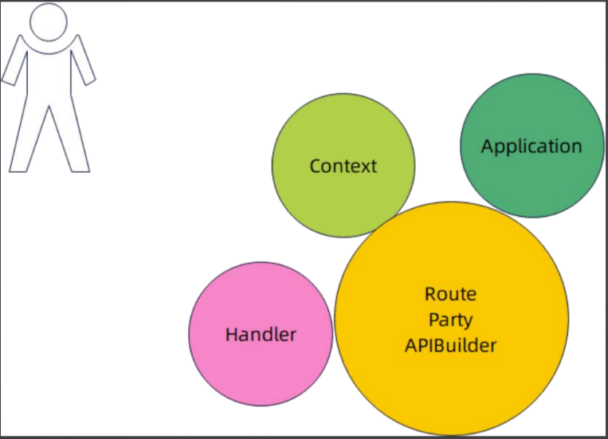

# 4. Web框架概览-Iris框架分析

## PART1. 基本使用

```GO
package iris

import (
	"github.com/kataras/iris/v12"
	"testing"
)

func TestHelloWorld(t *testing.T) {
	app := iris.New()

	app.Get("/", func(ctx iris.Context) {
		_, _ = ctx.HTML("Hello <strong>%s</strong>!", "World")
	})

	_ = app.Listen(":8083")
}
```

和GIN相同,注册路由时可以使用匿名函数,也可以使用handleFunc.

## PART2. Application

上述示例中的`iris.New()`,实际上返回的是一个`Application`实例:

```GO
// Application is responsible to manage the state of the application.
// It contains and handles all the necessary parts to create a fast web server.
type Application struct {
	// routing embedded | exposing APIBuilder's and Router's public API.
	*router.APIBuilder
	*router.Router
	ContextPool *context.Pool

	config *Configuration

	logger *golog.Logger

	I18n *i18n.I18n

	// view engine
	view view.View
	// used for build
	builded     bool
	defaultMode bool

	mu sync.Mutex
	Hosts             []*host.Supervisor
	hostConfigurators []host.Configurator
}
```

这个`Application`就是Iris中的核心抽象,它代表的是"应用".从语义上来讲`Application`更接近Beego中的`HttpServer`和GIN中的`Engine`.这一点从例子中的`app.Listen(":8083")`这行代码就能看出来.它提供了:

- 生命周期控制功能:例如`Application.Run()`/`Application.Shutdown()`等方法
- 注册路由的API:例如`Application`中的`APIBuilder`字段(该字段的类型为`*router.APIBuilder`),该字段有`APIBuilder.Get()`/`APIBuilder.Post()`等方法

一种观点认为:Application这个名字不是很合适,**因为有一些应用会监听多个端口,不同的端口提供不同的功能**(这个之前的笔记里有写到),也就是常说的多Server应用.相比之下,HttpServer或Engine更合适一些.

## PART3. 路由相关功能

Iris的设计非常复杂.在Beego和Gin里面能够明显看到路由树的痕迹(Beego中的ControllerRegister和GIN中的methodTrees),但是在Iris里面就很难看出来.

Iris中和处理路由相关的有3个抽象:Route、APIBuilder、repository

### 3.1 Route

Route:直接代表了已经注册的路由.在Beego和GIN中,对应的是路由树中的节点(例如GIN中的`gin.node`)

```GO
// Route contains the information about a registered Route.
// If any of the following fields are changed then the
// caller should Refresh the router.
type Route struct {
	// The Party which this Route was created and registered on.
	Party       Party
	Title       string         `json:"title"`       // custom name to replace the method on debug logging.
	Name        string         `json:"name"`        // "userRoute"
	Description string         `json:"description"` // "lists a user"
	Method      string         `json:"method"`      // "GET"
	StatusCode  int            `json:"statusCode"`  // 404 (only for HTTP error handlers).
	methodBckp  string         // if Method changed to something else (which is possible at runtime as well, via RefreshRouter) then this field will be filled with the old one.
	Subdomain   string         `json:"subdomain"` // "admin."
	tmpl        macro.Template // Tmpl().Src: "/api/user/{id:uint64}"

	beginHandlers context.Handlers
	builtinBeginHandlers context.Handlers

	Handlers         context.Handlers `json:"-"`
	MainHandlerName  string           `json:"mainHandlerName"`
	MainHandlerIndex int              `json:"mainHandlerIndex"`
	doneHandlers context.Handlers

	Path string `json:"path"` // the underline router's representation, i.e "/api/user/:id"
	FormattedPath string `json:"formattedPath"`

	SourceFileName   string `json:"sourceFileName"`
	SourceLineNumber int    `json:"sourceLineNumber"`

	RegisterFileName   string `json:"registerFileName"`
	RegisterLineNumber int    `json:"registerLineNumber"`

	topLink *Route
	overlappedLink *Route

	// Sitemap properties: https://www.sitemaps.org/protocol.html
	NoSitemap  bool      // when this route should be hidden from sitemap.
	LastMod    time.Time `json:"lastMod,omitempty"`
	ChangeFreq string    `json:"changeFreq,omitempty"`
	Priority   float32   `json:"priority,omitempty"`

	// ReadOnly is the read-only structure of the Route.
	ReadOnly context.RouteReadOnly

	// OnBuild runs right before BuildHandlers.
	OnBuild func(r *Route)
	NoLog   bool // disables debug logging.
}
```

### 3.2 APIBuilder

APIBuilder:创建Route的Builder模式,Party也是它创建的.

```GO
// APIBuilder the visible API for constructing the router
// and child routers.
type APIBuilder struct {
	logger *golog.Logger
	parent *APIBuilder // currently it's not used anywhere.

	apiBuilderDI *APIContainer

	macros *macro.Macros
	properties context.Map
	routes *repository
	routesNoLog bool

	middleware          context.Handlers
	middlewareErrorCode context.Handlers
	beginGlobalHandlers context.Handlers

	// the per-party done handlers, order matters.
	doneHandlers context.Handlers
	doneGlobalHandlers context.Handlers

	relativePath string
	allowMethods []string

	handlerExecutionRules ExecutionRules
	routeRegisterRule RouteRegisterRule

	routerFilterHandlers context.Handlers
	routerFilters map[Party]*Filter
	partyMatcher PartyMatcherFunc
}
```

### 3.3 repository

repository:存储了所有的Routes,有点接近GIN的methodTrees的概念

```GO
// repository passed to all parties(subrouters), it's the object witch keeps
// all the routes.
type repository struct {
	routes []*Route
	paths  map[string]*Route // only the fullname path part, required at CreateRoutes for registering index page.
}
```

讲师观点:过于复杂,职责不清晰,难以划定每个结构体的职责边界.不符合一般人的直觉,新人学习和维护门槛高,不要学.

## PART4. Context抽象

Context也是表示一个请求的**上下文**.它本身也提供了**各种处理请求和响应的方法**.基本上和Beego、GIN的Context没啥区别.比较有特色的一点是:**Iris的Context支持请求级别的添加Handler,即`AddHandler()`方法**.有点像GIN中IRoutes接口中定义的`Handle()`方法,可以看到二者AOP的粒度是不同的,Iris是在方法级别上控制,而GIN是在Server级别控制.

## PART5. 抽象总结



- Route & Party & APIBuilder:解决路由相关(路由注册/路由匹配等)的问题
- Application:解决HTTPServer的问题
- Context:解决请求的上下文问题
- Handler:具体的业务逻辑代码

