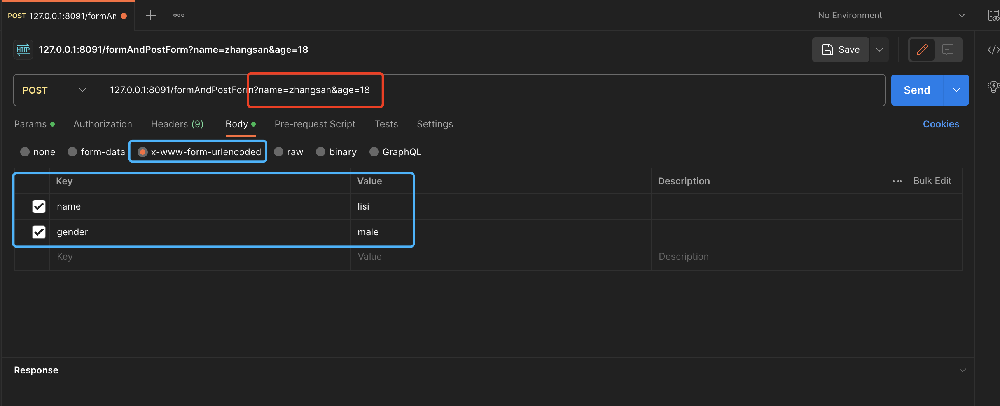
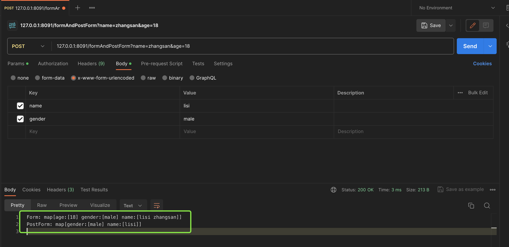

# 7. Context-处理输入之表单输入

本节课工程路径如下:

```
(base) yanglei@yuanhong 03-formValue % tree ./
./
├── context.go
├── handleFunc.go
├── httpServer.go
├── httpServer_test.go
├── matchNode.go
├── node.go
├── router.go
├── router_test.go
└── serverInterface.go

0 directories, 9 files
```

注:相比于`02-bindJSON`,有如下变更:

1. 删除了演示用的`config.go`
2. 删除了`HTTPServer`结构体中的`useNumber`和`disallowUnknownFields`字段(这两个字段也是上节课演示用的)

## PART1. `http.Request.Form`与`http.Request.PostForm`的区别

- `http.Request.Form`:可以接收URL中的参数以及HTTP动词为`PATCH`、`POST`、`PUT`时的表单数据
- `http.Request.PostForm`:只能接收HTTP动词为`PATCH`、`POST`、`PUT`时的表单数据
- **不管使用以上二者中的哪一种,都要先调用`http.Request.ParseForm()`解析表单数据后,这两个字段才有数据**

示例:

```go
package main

import (
	"fmt"
	"log"
	"net/http"
)

func main() {
	http.HandleFunc("/formAndPostForm", formAndPostFormHandle)
	log.Fatal(http.ListenAndServe(":8091", nil))
}

func formAndPostFormHandle(w http.ResponseWriter, r *http.Request) {
	err := r.ParseForm()
	if err != nil {
		log.Fatal("ParseForm failed: ", err)
	}

	fmt.Fprintf(w, "Form: %v\n", r.Form)
	fmt.Fprintf(w, "PostForm: %v\n", r.PostForm)
}
```

请求如下图示:



可以看到,URL中的参数为:

- `name=zhangsan`
- `age=18`

表单数据中的参数为:

- `name=lisi`
- `gender=male`

响应如下图示:



可以看到:

- `http.Request.Form`既可以收到URL中的参数,也可以接收到表单中的参数
- `http.Request.PostForm`只能接收到表单中的参数
- **注意,二者的返回值类型都是[`url.Values`](https://github.com/golang/go/blob/d6ef98b8fa4851f025779ef4ade084d63290de2a/src/net/url/url.go#L886),实际上就是`map[string][]string`**

二者最核心的区别在于:

- `http.Request.Form`:基本上可以认为**能够拿到所有的表单数据**
- `http.Request.PostForm`:只能拿到ContentType为`x-www-form-urlencoded`时的表单数据

**不建议使用表单的方式进行通信,而是建议在Body中写入JSON或Protobuf的方式进行通信.因为在数据结构较为复杂的场景下,使用使用JSON或Protobuf比使用Form的可读性要更高.因此在可选择的前提下,尽可能采用Body中中写入JSON或Protobuf的方式进行通信**.

## PART2. 实现`Context.FormValue()`方法

### 2.1 完全自行实现

```go
// FormValue1 获取表单中给定键的值
func (c *Context) FormValue1(key string) (value string, err error) {
	err = c.Req.ParseForm()
	if err != nil {
		return "", errors.New("web绑定错误: 解析表单失败: " + err.Error())
	}

	values, ok := c.Req.Form[key]
	if !ok {
		return "", errors.New("web绑定错误: 表单中不存在键: " + key)
	}

	// Tips: 这里只返回第一个值,这样的设计是参照了net/http包中的FormValue()方法
	return values[0], nil
}
```

注意,这里只返回同名参数中的第1个值,是参照了[`http.Request.FormValue()`](https://github.com/golang/go/blob/master/src/net/http/request.go#L1378)方法的返回.

这里不建议如下方式的实现:

```go
// FormValue2 获取表单中给定键的值 不建议按此方式返回 因为大部分场景下表单中的键都是唯一的
func (c *Context) FormValue2(key string) (values []string, err error) {
	err = c.Req.ParseForm()
	if err != nil {
		return nil, errors.New("web绑定错误: 解析表单失败: " + err.Error())
	}

	values, ok := c.Req.Form[key]
	if !ok {
		return nil, errors.New("web绑定错误: 表单中不存在键: " + key)
	}

	return values, nil
}
```

**不建议按此方式返回,因为大部分场景下表单中的键都是唯一的**.还是上节课提到的观点:**为了支持一个小众的需求,反而会影响到大部分主流用户的使用,那么就不要支持这个小众的需求**.

### 2.2 依赖原生API的实现

```go
// FormValue3 获取表单中给定键的值 推荐使用这种实现 因为这种实现的语义和原生API语义相同
func (c *Context) FormValue3(key string) (value string, err error) {
	err = c.Req.ParseForm()
	if err != nil {
		return "", errors.New("web绑定错误: 解析表单失败: " + err.Error())
	}

	return c.Req.FormValue(key), nil
}
```

**推荐使用这种实现,因为这种实现的语义和原生API语义相同**.

甚至可以不要前边对于`http.Request.ParseForm()`方法返回值的错误判断部分.但不建议这么做.因为虽然[`http.Request.ParseMultipartForm()`](https://github.com/golang/go/blob/master/src/net/http/request.go#L1328)方法会进行解析并返回解析错误,但它返回的错误被[`http.Request.FormValue()`](https://github.com/golang/go/blob/master/src/net/http/request.go#L1390)方法在调用时给丢弃掉了,没有处理.所以最好还是主动自己解析一下,以防万一.

## PART3. 相关问题

### 3.1 多次调用`Context.FormValue()`方法是否会造成重复解析?

答案是不会的.**因为`http.Request.ParseForm()`方法的调用是幂等的**.证据如下:

- [`http.Request.ParseForm()`方法的注释说明](https://github.com/golang/go/blob/master/src/net/http/request.go#L1284)
- [仅在`http.Request.PostForm`字段值不为`nil`时解析](https://github.com/golang/go/blob/master/src/net/http/request.go#L1287)
- [仅在`http.Request.Form`字段值不为`nil`时解析](https://github.com/golang/go/blob/master/src/net/http/request.go#L1295)

这里有一种观点认为在GIN中,[`gin.Context.formCache`](https://github.com/gin-gonic/gin/blob/master/context.go#L82)字段是没有必要设计的,因为原生的`http.Request.Form`和`http.Request.PostForm`字段本身就起到了缓存的效果

### 3.2 是否需要提供返回其他数据类型的API?

例如:根据给定的`key`,返回一个`int64`类型数据的方法.其实现如下:

```go
// FormValueAsInt64 获取表单中给定键的值 并将该值转换为int64类型返回
func (c *Context) FormValueAsInt64(key string) (int64Value int64, err error) {
	err = c.Req.ParseForm()
	if err != nil {
		return 0, errors.New("web绑定错误: 解析表单失败: " + err.Error())
	}

	value := c.Req.FormValue(key)
	return strconv.ParseInt(value, 10, 64)
}
```

那么问题来了:要不要实现这种(注意是这种不是这个)API?

如果要提供的话,至少要提供3个:

- 获取表单中给定键的值,并将该值转换为`int64`类型返回
- 获取表单中给定键的值,并将该值转换为`uint64`类型返回
- 获取表单中给定键的值,并将该值转换为`float64`类型返回

用户拿到这3种类型的数据,再自己向下转型(强制类型转换).

但其实不需要提供.这里因为其他处理输入的API也会遇到类似的问题,后边统一讲这个事情.