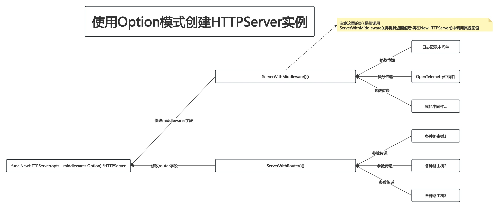
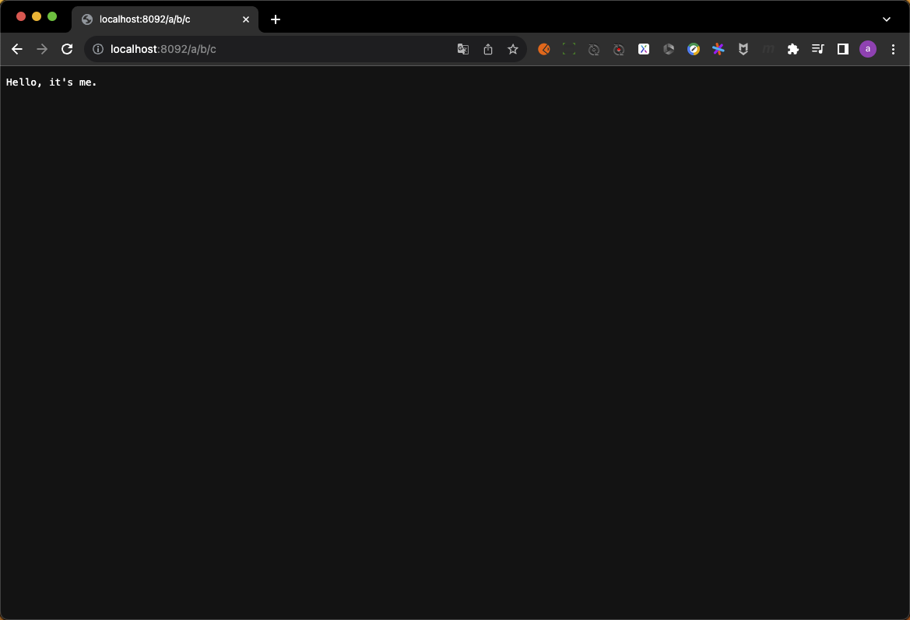

# 13. Middleware-AccessLog


## PART1. 为什么要有AccessLog?

在日常工作中,我们可能希望**能够记录所有进来的请求,以支持Debug**.这也就是所谓的AccessLog.

Beego、Iris、Gin都支持了AccessLog.这里我们也提供一个简单的AccessLog Middleware

## PART2. 实现

初态目录结构如下:

```
(base) yanglei@yuanhong 01-accessLog % tree ./
./
├── context.go
├── context_test.go
├── go.mod
├── go.sum
├── handleFunc.go
├── httpServer.go
├── httpServer_test.go
├── matchNode.go
├── middleware.go
├── middleware_test.go
├── node.go
├── router.go
├── router_test.go
├── safeContext.go
├── serverInterface.go
└── stringValue.go

0 directories, 16 files
```

### 2.1 创建中间件的过程

创建目录:

- `/middlewares`: 用于存放所有中间件的代码
- `/middlewares/access_log`: 用于存储accessLog中间件的代码

```
(base) yanglei@yuanhong 01-accessLog % tree ./
./
├── context.go
├── context_test.go
├── go.mod
├── go.sum
├── handleFunc.go
├── httpServer.go
├── httpServer_test.go
├── matchNode.go
├── middleware.go
├── middleware_test.go
├── middlewares
│   └── access_log
├── node.go
├── router.go
├── router_test.go
├── safeContext.go
├── serverInterface.go
└── stringValue.go

2 directories, 16 files
```

这里使用生成器模式来完成中间件的创建.先将生成器模式的结构写出来,不考虑具体的日志记录功能:

`middlewares/access_log/middlewareBuilder.go`:

```go
package access_log

import "web"

// MiddlewareBuilder accessLog中间件的构建器
type MiddlewareBuilder struct{}

func (m *MiddlewareBuilder) Build() web.Middleware {
	return func(next web.HandleFunc) web.HandleFunc {
		return func(ctx *web.Context) {
			// 记录日志
			next(ctx)
		}
	}
}
```

### 2.2 定义中间件结构

这里我们假定需要记录的日志内容如下:

- 请求的主机地址
- 命中的路由
- 请求的HTTP动词
- 请求的uri(路径)

`middlewares/access_log/accessLog.go`:

```go
package access_log

// accessLog 定义访问日志的结构
type accessLog struct {
	Host       string `json:"host,omitempty"`       // Host 主机地址
	Route      string `json:"route,omitempty"`      // Route 命中的路由
	HTTPMethod string `json:"HTTPMethod,omitempty"` // HTTPMethod 请求的HTTP方法
	Path       string `json:"path,omitempty"`       // Path 请求的路径 即请求的uri部分
}
```

### 2.3 获取要记录的字段值

#### 2.3.1 基本实现

这里我们开始实现日志记录,完善`MiddlewareBuilder.Build()`方法

`middlewares/access_log/middlewareBuilder.go`:

```go
package access_log

import "web"

// MiddlewareBuilder accessLog中间件的构建器
type MiddlewareBuilder struct{}

func (m *MiddlewareBuilder) Build() web.Middleware {
	return func(next web.HandleFunc) web.HandleFunc {
		return func(ctx *web.Context) {
			// 调用业务处理函数完成后记录日志
			defer func() {
				accessLogObj := accessLog{
					Host:       ctx.Req.Host,
					// TODO: Route字段的值需要从命中的路由处获取
					Route:      "",
					HTTPMethod: ctx.Req.Method,
					Path:       ctx.Req.URL.Path,
				}
				// TODO: 写入日志
			}()
			next(ctx)
		}
	}
}
```

这里选择在defer中记录请求的原因:

1. `next(ctx)`可能会出现panic,如果将记录请求的代码直接写在调用`next(ctx)`后边,那么有可能不会被执行
2. 当然你也可以设计为在调用`next(ctx)`前记录请求,但如果在记录请求的过程中出现了panic,那么就会因为一些非关键流程的错误导致整个流程跑不通,是一种得不偿失的做法
3. 综上所述,写在`next(ctx)`,或者写在`next(ctx)`后,都有各自的问题.还是写在defer中最合适

这里我们遇到了第一个问题:命中的路由从哪里来?

#### 2.3.2 记录命中的路由

首先毫无疑问的一点是:命中的路由也得从`web.Context`中拿.那很明显现在的`web.Context`没有这个字段,需要加上:

`context.go`:

```go
// Context HandleFunc的上下文
type Context struct {
	Req            *http.Request       // Req 请求
	Resp           http.ResponseWriter // Resp 响应
	PathParams     map[string]string   // PathParams 路径参数名值对
	queryValues    url.Values          // queryValues 查询参数名值对
	cookieSameSite http.SameSite       // cookieSameSite cookie的SameSite属性 即同源策略
	MatchRoute     string              // MatchRoute 命中的路由
}
```

第2个问题就是:在哪里给这个字段赋值?

很明显是在查找到命中的路由之后,即`HTTPServer.serve()`方法中赋值:

`httpServer.go`:

```go
// serve 查找路由树并执行命中的业务逻辑
func (s *HTTPServer) serve(ctx *Context) {
	method := ctx.Req.Method
	path := ctx.Req.URL.Path
	targetNode, ok := s.findRoute(method, path)
	// 没有在路由树中找到对应的路由节点 或 找到了路由节点的处理函数为空(即NPE:none pointer exception 的问题)
	// 则返回404
	if !ok || targetNode.node.HandleFunc == nil {
		ctx.Resp.WriteHeader(http.StatusNotFound)
		// 此处确实会报错 但是作为一个WEB框架 遇上了这种错误也没有特别好的处理办法
		// 最多只能是落个日志
		_, _ = ctx.Resp.Write([]byte("Not Found"))
		return
	}

	// 命中节点则将路径参数名值对设置到上下文中
	ctx.PathParams = targetNode.pathParams

	// 命中节点则将节点的路由设置到上下文中
	ctx.MatchRoute = targetNode.node.path

	// 执行路由节点的处理函数
	targetNode.node.HandleFunc(ctx)
}
```

注:

- 很明显此处我们只是记录了命中的路由的最后一段,即:假设注册的路由为`/a/b/*`,此处我们只是记录了`*`.这个属于细节问题,后续再调整.我写代码时也应该是这样:**先实现整体的结构,再调整细节**

#### 2.3.3 获取命中的路由

到这一步就比较顺理成章了:

`middlewares/access_log/middlewareBuilder.go`:

```go
package access_log

import "web"

// MiddlewareBuilder accessLog中间件的构建器
type MiddlewareBuilder struct{}

func (m *MiddlewareBuilder) Build() web.Middleware {
	return func(next web.HandleFunc) web.HandleFunc {
		return func(ctx *web.Context) {
			// 调用业务处理函数完成后记录日志
			defer func() {
				accessLogObj := accessLog{
					Host:       ctx.Req.Host,
					Route:      ctx.MatchRoute,
					HTTPMethod: ctx.Req.Method,
					Path:       ctx.Req.URL.Path,
				}
				// TODO: 写入日志
			}()
			next(ctx)
		}
	}
}
```

### 2.4 记录请求

到了这一步,剩下的就是记录日志了.有的人(包括我)到这一步可能直接就打印了:

`middlewares/access_log/middlewareBuilder.go`:

```go
package access_log

import (
	"log"
	"web"
)

// MiddlewareBuilder accessLog中间件的构建器
type MiddlewareBuilder struct{}

func (m *MiddlewareBuilder) Build() web.Middleware {
	return func(next web.HandleFunc) web.HandleFunc {
		return func(ctx *web.Context) {
			// 调用业务处理函数完成后记录日志
			defer func() {
				accessLogObj := accessLog{
					Host:       ctx.Req.Host,
					Route:      ctx.MatchRoute,
					HTTPMethod: ctx.Req.Method,
					Path:       ctx.Req.URL.Path,
				}
				log.Print(accessLogObj)
			}()
			next(ctx)
		}
	}
}
```

那么问题来了:如果框架的使用者,不希望使用GO原生的log包来打印日志(甚至使用者的需求不是打印日志而是将日志写入文件等),该怎么办?

因此应该提供一种方式,让**框架的使用者从外部定义打印日志的过程**:

#### 2.4.1 对外暴露控制记录方式的接口

这里的"接口",指的不是编码时的`interface`,而是提供给外部的、让外部控制记录方式的一个"入口"(这里我确实没找到合适的词来形容)

`middlewares/access_log/middlewareBuilder.go`:

```go
package access_log

import (
	"log"
	"web"
)

// MiddlewareBuilder accessLog中间件的构建器
type MiddlewareBuilder struct {
	logFunc func(logContent string) // logFunc 记录日志的函数,该函数用于提供给外部,让使用者自定义日志记录的方式
}

// SetLogFunc 设置记录日志的函数并返回构建器.返回构建器的目的在于:在使用时可以链式调用
// 即:使用时可以写出如下代码:
// m := &MiddlewareBuilder{}
//
//	m.SetLogFunc(func(logContent string) {
//		log.Print(logContent)
//	}).Build()
func (m *MiddlewareBuilder) SetLogFunc(logFunc func(logContent string)) *MiddlewareBuilder {
	m.logFunc = logFunc
	return m
}
```

1. 先定义了一个函数类型的字段,该字段用于存储外部提供的记录日志函数
2. 再定义一个方法,该方法对外暴露,用于让外部设置记录日志函数

**这是典型的生成器模式的应用**.注意`MiddlewareBuilder.SetLogFunc()`方法的返回值,仍旧是一个`MiddlewareBuilder`的实例,这样的设计是为了在使用时可以链式调用,更加方便

#### 2.4.2 使用外部提供的函数记录日志

这样再记录日志就很容易了.

`middlewares/access_log/middlewareBuilder.go`:

```go
// Build 构建中间件
func (m *MiddlewareBuilder) Build() web.Middleware {
	return func(next web.HandleFunc) web.HandleFunc {
		return func(ctx *web.Context) {
			// 调用业务处理函数完成后记录日志
			defer func() {
				accessLogObj := accessLog{
					Host:       ctx.Req.Host,
					Route:      ctx.MatchRoute,
					HTTPMethod: ctx.Req.Method,
					Path:       ctx.Req.URL.Path,
				}

				accessLogBytes, _ := json.Marshal(accessLogObj)
				m.logFunc(string(accessLogBytes))
			}()
			next(ctx)
		}
	}
}
```

这里就是单纯的将`accessLog `结构体的实例转为一个JSON,以便后续能够将其承载的数据转换为string类型.

## PART3. 传递中间件

先写测试用例,以便发现问题:

`middlewares/access_log/middleware_test.go`:

```go
package access_log

import (
	"fmt"
	"testing"
	"web"
)

// Test_MiddlewareBuilder 测试记录日志中间件
func Test_MiddlewareBuilder(t *testing.T) {
	// 创建记录日志中间件
	builder := &MiddlewareBuilder{}
	accessLogMiddleware := builder.SetLogFunc(func(logContent string) {
		fmt.Println(logContent)
	}).Build()

	// 创建HTTPServer
	s := web.NewHTTPServer()
	// TODO: 怎么将中间件链添加到HTTPServer中?
}
```

现在问题出现了:该怎么将中间件加入到HTTPServer中?

### 3.1 方案1:实例化`HTTPServer`时传入中间件链

#### 3.1.1 实现

`httpServer.go`:

```go
// NewHTTPServerWithMiddleware 根据给定的中间件创建HTTP服务器
// 用这种方式创建中间件链的缺点在于: 缺乏扩展性
// 具体而言:
// 1. 如果以后的需求变更导致需要在middlewares前后添加其他的参数的话,整个函数的签名就都变了
// 2. 中间件链的顺序在创建`HTTPServer`实例时就固定了,无法灵活调整
func NewHTTPServerWithMiddleware(middlewares ...Middleware) *HTTPServer {
	return &HTTPServer{
		router:      newRouter(),
		middlewares: middlewares,
	}
}
```

#### 3.1.2 使用

`middlewares/access_log/middleware_test.go`:

```go
// Test_MiddlewareBuilder 测试记录日志中间件
func Test_MiddlewareBuilder(t *testing.T) {
	// 创建记录日志中间件
	builder := &MiddlewareBuilder{}
	accessLogMiddleware := builder.SetLogFunc(func(logContent string) {
		fmt.Println(logContent)
	}).Build()

	// 创建HTTPServer
	s := web.NewHTTPServerWithMiddleware(accessLogMiddleware)
	s.Start(":8080")
}
```

#### 3.1.3 优缺点

优点:

1. 直观,好理解

缺点:

1. 如果以后的需求变更导致需要在形参`middlewares`前后添加其他的参数的话,整个函数的签名就都变了.可想而知受这个函数签名变化的影响,要修改的地方会有很多
2. 中间件链的顺序在创建`HTTPServer`实例时就固定了,无法灵活调整

### 3.2 方案2:将`HTTPServer.middlewares`字段设置为公有属性

#### 3.2.1 实现

`httpServer.go`:

```go
// HTTPServer HTTP服务器
type HTTPServer struct {
	router                   // router 路由树
	Middlewares []Middleware // Middlewares 中间件切片.表示HTTPServer需要按顺序执行的的中间件链
}
```

#### 3.2.2 使用

`middlewares/access_log/middleware_test.go`:

```go
// Test_MiddlewareBuilder 测试记录日志中间件
func Test_MiddlewareBuilder(t *testing.T) {
	// 创建记录日志中间件
	builder := &MiddlewareBuilder{}
	accessLogMiddleware := builder.SetLogFunc(func(logContent string) {
		fmt.Println(logContent)
	}).Build()

	// 创建HTTPServer
	s := web.NewHTTPServer()
	if s.Middlewares == nil {
		s.Middlewares = make([]web.Middleware, 0)
	}
	s.Middlewares = append(s.Middlewares, accessLogMiddleware)
}
```

#### 3.2.3 优缺点

优点:

1. 直观,好理解

缺点:

1. 使用者调用了`NewHTTPServer()`函数之后,还要单独设置`HTTPServer.Middlewares`字段.似乎看起来也不方便使用
2. 不够灵活.换言之,**抽象层级不够高**

### 3.3 Option模式

其实我们要做的就是一件事:把在包(在我的示例代码中是`web`包)的外部创建的中间件,传入到`HTTPServer`结构体的实例上去.

我第一反应的想法:

```go
// SetMiddleware 本方法用于设置HTTPServer实例的middlewares属性
func (s *HTTPServer) SetMiddleware(middlewares ...Middleware)  {
	s.middlewares = middlewares
}
```

我们把这个思路的抽象层级再提升一层:**如果把"为`HTTPServer`结构体的属性赋值"这件事看做是一个"职责"(这里的职责是指设计模式原则中的"单一职责"),会怎么样?**

很明显能得到一个答案:需要一个类来完成这个职责.至此,Option模式的第一步出现了:创建`Option`类.

#### 3.3.1 创建HTTPServerOption结构体

`option.go`:

```go
package web

// Option HTTPServer的选项
// 不同的 Option 用于设置HTTPServer实例的不同属性
type Option func(server *HTTPServer)
```

注意这个结构体的类型为`func(server *web.HTTPServer)`,我们在这个函数的内部修改`web.HTTPServer`实例的属性值即可

第2个问题随之而来:怎么修改`web.HTTPServer`实例的属性值?

#### 3.3.2 实现修改`web.HTTPServer`实例的属性值的函数

这个问题比较容易回答:直接在函数体内部修改就行了,反正结构体实例的指针都已经拿到了

`httpServer.go`:

```go
// ServerWithMiddleware 本函数用于为HTTPServer实例添加中间件
// 即: 本函数用于设置HTTPServer实例的middlewares属性
func ServerWithMiddleware(middlewares ...Middleware) middlewares.Option {
	return func(server *HTTPServer) {
		server.middlewares = middlewares
	}
}
```

第3个问题又来了:什么时候修改属性值?

#### 3.3.3 调用函数修改`web.HTTPServer`实例的属性值

答案也比较简单:当然是创建出`HTTPServer`实例之后修改了

`httpServer.go`:

```go
// NewHTTPServer 创建HTTP服务器
// 这里选项的含义其实是指不同的 Option 函数
// 每一个 Option 函数都会对 HTTPServer 实例的不同属性进行设置
func NewHTTPServer(opts ...middlewares.Option) *HTTPServer {
	server := &HTTPServer{
		router: newRouter(),
	}

	for _, opt := range opts {
		opt(server)
	}

	return server
}
```



至此我们完成了使用Option模式创建HTTPServer实例的过程,继续回到测试代码上

## PART4. 测试并调试

### 4.1 以创建`http.Request`的方式编写测试用例

这里我们先手动创建一个请求,因为我们现在写的这个测试用例,是为了测试主逻辑是否正确的

`middlewares/access_log/middleware_test.go`:

```go
package access_log

import (
	"fmt"
	"net/http"
	"testing"
	"web"
)

// Test_MiddlewareBuilder 测试记录日志中间件
func Test_MiddlewareBuilder(t *testing.T) {
	// 创建记录日志中间件
	builder := &MiddlewareBuilder{}
	// 注意这里的链式调用 使得在创建中间件的同时就可以设置记录日志的函数
	accessLogMiddleware := builder.SetLogFunc(func(logContent string) {
		fmt.Println(logContent)
	}).Build()

	// 创建中间件Option
	middlewareOption := web.ServerWithMiddleware(accessLogMiddleware)

	// 创建服务器
	// 这里就可以看出Option模式的好处了: 通过不同的Option函数可以设置HTTPServer实例的不同属性
	s := web.NewHTTPServer(middlewareOption)

	// 注册路由
	s.GET("/a/b/*", func(ctx *web.Context) {
		fmt.Println("hello, it's me")
	})

	// 创建请求
	request, err := http.NewRequest(http.MethodGet, "/a/b/c", nil)
	if err != nil {
		t.Fatal(err)
	}

	// 启动服务器
	s.ServeHTTP(nil, request)
}
```

运行结果:

```
=== RUN   Test_MiddlewareBuilder
hello, it's me
{"route":"*","HTTPMethod":"GET","path":"/a/b/c"}
--- PASS: Test_MiddlewareBuilder (0.00s)
PASS
```

### 4.2 测试发现的问题

1. `accessLog.Route`字段记录的值不正确.这里日志应该记录的是`/a/b/*`,而非`*`
2. `accessLog.Host`值没记录上

这里第2个问题是好解决的,只要正常通过HTTP访问的请求,都能拿到这个Host.我们的测试用例由于是通过调用`http.NewRequest()`函数拿到的一个`http.Request`实例,因此`http.Request.Host`字段没有值

重点是第1个问题.

### 4.3 修Bug:命中的路由在日志中记录不正确

这个Bug比较好修.整体思路分为4步:

- step1. 为`node`结构体添加一个**承载该节点对应的全路由**的字段.注意:这里不需要为路由树上的每个节点都赋值该字段
	- 例如:注册路由`/a/b/c`,其实只需为最深层的`c`节点赋值全路由即可.因为我们添加这个字段的目的是为了**在记录日志时能够取到**,而实际上用户如果访问路由`/a`或`/a/b`,根本就命中不了任何路由,也就不用记录日志了

- step2. 注册路由时将全路由写入到节点(确切的说是绑定了`HandleFunc`的节点)中

- step3. 匹配节点时从命中的节点中读取该字段并赋值给`Context`

- step4. 记录日志时从`Context`中读取全路由(其实现在就是从`Context`中读取的全路由,所以这一步不用改任何代码)

#### 4.3.1 为`node`结构体添加用于承载全路径的字段

`node.go`:

```go
// node 路由树的节点
type node struct {
	route         string           // route 当前节点的全路由
	path          string           // path 当前节点的路径
	children      map[string]*node // children 子路由路径到子节点的映射
	wildcardChild *node            // wildcardChild 通配符子节点
	paramChild    *node            // paramChild 参数子节点
	HandleFunc                     // HandleFunc 路由对应的业务逻辑
}
```

#### 4.3.2 将全路由写入到节点中

`router.go`:

```go
func (r *router) addRoute(method string, path string, handleFunc HandleFunc) {
	if path == "" {
		panic("web: 路由不能为空字符串")
	}

	if path[0] != '/' {
		panic("web: 路由必须以 '/' 开头")
	}

	if path != "/" && path[len(path)-1] == '/' {
		panic("web: 路由不能以 '/' 结尾")
	}

	root, ok := r.trees[method]
	if !ok {
		root = &node{
			path: "/",
		}
		r.trees[method] = root
	}

	if path == "/" {
		if root.HandleFunc != nil {
			panic("web: 路由冲突,重复注册路由 [/] ")
		}
		root.HandleFunc = handleFunc

		// 记录根节点的全路由(实际上就是"/")
		root.route = path
		return
	}

	path = strings.TrimLeft(path, "/")
	segments := strings.Split(path, "/")

	target := root
	for _, segment := range segments {
		if segment == "" {
			panic("web: 路由中不得包含连续的'/'")
		}

		child := target.childOrCreate(segment)
		
		target = child
	}

	if target.HandleFunc != nil {
		panic(fmt.Sprintf("web: 路由冲突,重复注册路由 [%s] ", path))
	}

	target.HandleFunc = handleFunc
	
	// 记录目标节点的全路由
	target.route = path
}
```

注:此处为了便于观看,只保留了记录全路由相关代码的注释,其他注释都删掉了

#### 4.3.3 匹配节点时从命中的节点中读取该字段并赋值给`Context`

`httpServer.go`:

```go
func (s *HTTPServer) serve(ctx *Context) {
	method := ctx.Req.Method
	path := ctx.Req.URL.Path
	targetNode, ok := s.findRoute(method, path)
	if !ok || targetNode.node.HandleFunc == nil {
		ctx.Resp.WriteHeader(http.StatusNotFound)
		_, _ = ctx.Resp.Write([]byte("Not Found"))
		return
	}

	ctx.PathParams = targetNode.pathParams

	// 命中节点则将节点的路由设置到上下文中
	ctx.MatchRoute = targetNode.node.route

	targetNode.node.HandleFunc(ctx)
}
```

注:此处为了便于观看,只保留了传递节点全路由给`Context`相关代码的注释,其他注释都删掉了

这里应该传递的是`node.route`而非`node.path`

#### 4.3.4 重新执行测试用例

测试用例的代码没有任何变更,重新测试的结果如下:

```
=== RUN   Test_MiddlewareBuilder
hello, it's me
{"route":"a/b/*","HTTPMethod":"GET","path":"/a/b/c"}
--- PASS: Test_MiddlewareBuilder (0.00s)
PASS
```

可以看到,此时结果符合预期了

### 4.4 以启动服务器的方式编写测试用例

这里我们就只剩下测试`Host`字段是否正常工作了:

`middlewares/access_log/middleware_test.go`:

```go
// Test_MiddlewareBuilderWithServer 以启动服务器的方式测试记录日志中间件
func Test_MiddlewareBuilderWithServer(t *testing.T) {
	// 创建记录日志中间件
	builder := &MiddlewareBuilder{}
	// 注意这里的链式调用 使得在创建中间件的同时就可以设置记录日志的函数
	accessLogMiddleware := builder.SetLogFunc(func(logContent string) {
		fmt.Println(logContent)
	}).Build()

	// 创建中间件Option
	middlewareOption := web.ServerWithMiddleware(accessLogMiddleware)

	// 创建服务器
	// 这里就可以看出Option模式的好处了: 通过不同的Option函数可以设置HTTPServer实例的不同属性
	s := web.NewHTTPServer(middlewareOption)

	// 注册路由
	s.GET("/a/b/*", func(ctx *web.Context) {
		ctx.Resp.Write([]byte("hello, it's me"))
	})

	// 启动服务器
	s.Start(":8092")
}
```

测试访问:



运行结果:

```
=== RUN   Test_MiddlewareBuilderWithServer
{"host":"localhost:8092","route":"a/b/*","HTTPMethod":"GET","path":"/a/b/c"}
```

## PART5. 潜在的问题

我们写的`MiddlewareBuilder.Build()`方法,相当于是一个样板,用户完全可以照猫画虎自己实现一个符合他需求的AccessLog中间件

这是老师和别人在**设计理念上的巨大差异**.在这种地方,用户完全可以自己提供扩展实现,且我们也设计了良好的接口让用户接入(回想`func NewHTTPServer(opts ...Option) *HTTPServer`的函数签名).老师也不愿意花费很多时间去设计精巧的结构和机制,去支持各种千奇百怪的用法.原则只有一个:**用户有特殊需求,用户就自己写**.

**默认提供的实现是给大多数普通用户使用的**,也相当于一个例子,有需要的用户可以参考这个实现写自己的实现.

对于大多数普通用户而言,简单记录一下`accessLogMiddleware`结构体中的字段(主机、命中的路由、请求的uri、请求的HTTP动词)就已经足够用了.更加复杂的、针对特定业务特性的AccessLog,应该自行实现.

在开源领域,也分为两类人:保姆型研发和简洁型研发

保姆型研发:使用者要什么,他们就去设计和实现什么,且实现时会考虑到方方面面的问题.尽可能的为用户着想,兼容用户的各种输入

简洁型研发:只提供主流的实现,但同时提供了扩展接口和例子给使用者.如果使用者有需求,让他们自己去实现.当然,使用者需要自己去学这个扩展接口怎么适配的