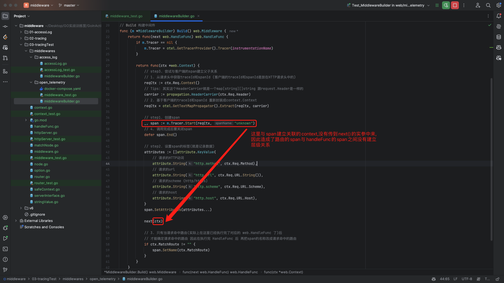
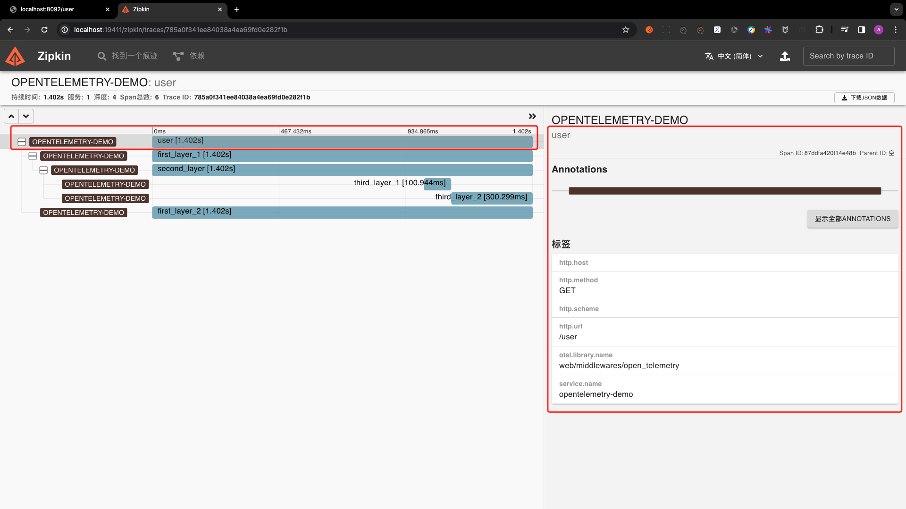
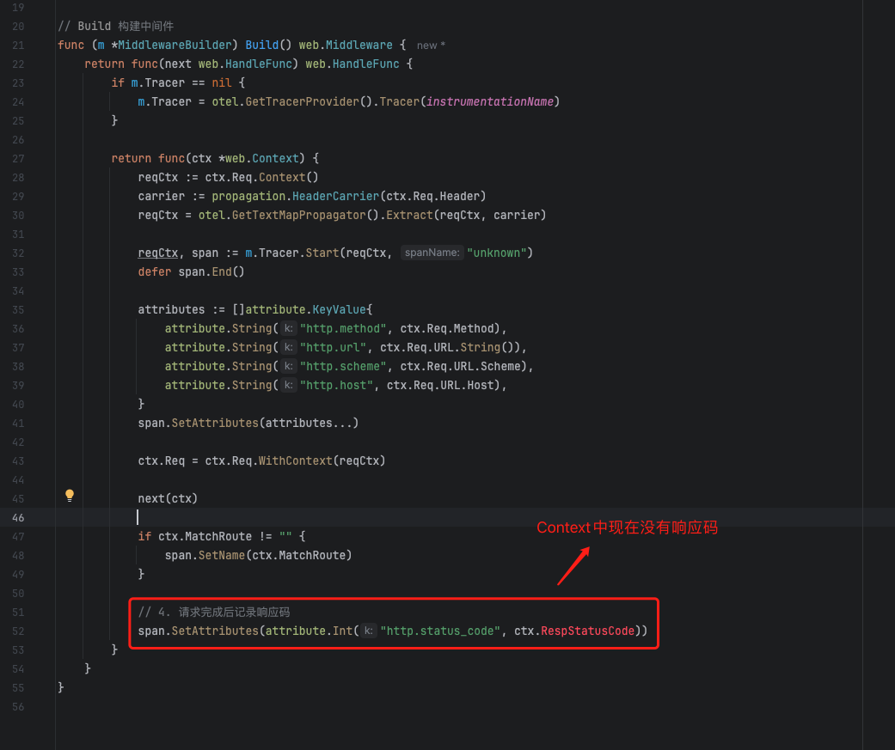
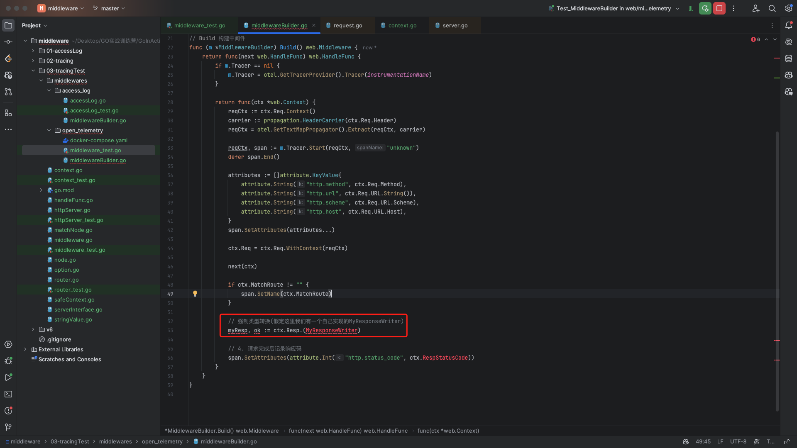
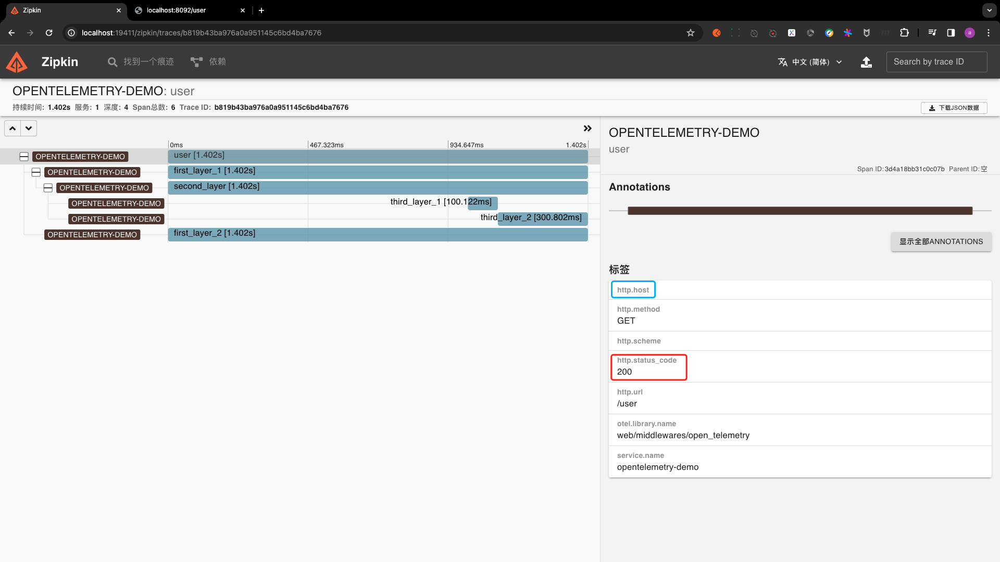
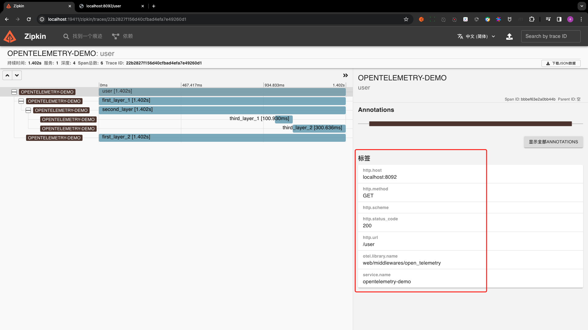

# 15. Middleware-OpenTelemetry测试

本节课工程结构如下:

```
(base) yanglei@yuanhong 03-tracingTest % tree ./
./
├── context.go
├── context_test.go
├── go.mod
├── go.sum
├── handleFunc.go
├── httpServer.go
├── httpServer_test.go
├── matchNode.go
├── middleware.go
├── middleware_test.go
├── middlewares
│   ├── access_log
│   │   ├── accessLog.go
│   │   ├── accessLog_test.go
│   │   └── middlewareBuilder.go
│   └── open_telemetry
│       └── middlewareBuilder.go
├── node.go
├── option.go
├── router.go
├── router_test.go
├── safeContext.go
├── serverInterface.go
└── stringValue.go

3 directories, 21 files
```

## PART1. 编写测试用例

想要完全的测试一个tracer是否正确存储其实是比较困难的,这里不太好办的点在于:你不太容易把span从OpenTelemetry中取出来看,进而确保这个span上报到了zipkin或jeager中.所以这里的测试思路只能是:写个HandleFunc,在这个HandleFunc中记录一些span,最后去zipkin或jeager中查看.

就像我们平时对一个CRUD的测试一样,写一个INSERT语句,测试之后只要看数据是否落盘即可.

### 1.1 创建Middleware和Server

`middlewares/open_telemetry/middleware_test.go`:

```go
package open_telemetry

import (
	"go.opentelemetry.io/otel"
	"testing"
	"time"
	"web"
)

// Test_MiddlewareBuilder 以创建 web.HandleFunc 的形式,在这个HandleFunc
// 中创建几个具有父子关系的span,并最终在第三方的tracing平台中查看这些span
func Test_MiddlewareBuilder(t *testing.T) {
	// 创建中间件
	tracer := otel.GetTracerProvider().Tracer(instrumentationName)
	builder := &MiddlewareBuilder{
		Tracer: tracer,
	}
	tracingMiddleware := builder.Build()

	// 创建中间件Option
	middlewareOption := web.ServerWithMiddleware(tracingMiddleware)

	// 创建服务器
	s := web.NewHTTPServer(middlewareOption)

	// 创建HandleFunc
	handleFunc := func(ctx *web.Context) {
		// 创建第1层span
		firstLayerContext1, firstLayerSpan1 := tracer.Start(ctx.Req.Context(), "first_layer_1")
		_, firstLayerSpan2 := tracer.Start(ctx.Req.Context(), "first_layer_2")

		// 创建第2层span 第2层的span是第1层span的子span
		secondLayerContext, secondLayerSpan := tracer.Start(firstLayerContext1, "second_layer")
		// 暂停1s 目的在于: 使得第2层span的开始时间与第1层span的开始时间有较为明显的时间差
		time.Sleep(time.Second)
		// 这里的defer secondLayerSpan.End()其实是可以不写的,因为在第一层span结束的时候,第二层span也会结束

		// 创建第3层的span 第3层的span是第2层span的子span
		_, thirdLayerSpan1 := tracer.Start(secondLayerContext, "third_layer_1")
		// 暂停100ms 先关闭第3层的第1个span
		time.Sleep(100 * time.Millisecond)
		thirdLayerSpan1.End()
		_, thirdLayerSpan2 := tracer.Start(secondLayerContext, "third_layer_2")
		// 暂停300ms 再关闭第3层的第2个span
		// 这样做是为了让第3层的2个span之间是一个有明显时间差的关系
		time.Sleep(300 * time.Millisecond)
		thirdLayerSpan2.End()

		// 再关闭第2层的span
		secondLayerSpan.End()

		// 最后关闭第1层的span
		firstLayerSpan1.End()
		firstLayerSpan2.End()

		ctx.Resp.Write([]byte("hello, world"))
		ctx.Resp.WriteHeader(http.StatusOK)
	}

	// 注册路由并启动服务器
	s.GET("/user", handleFunc)
	s.Start(":8092")
}
```

这里要注意,各层级的span之间是有父子关系的,创建的时候必然是先创建父span,再基于父span创建子span;关闭的时候则相反,需要先关闭子span再关闭父span.如果关闭的时候先关父span,则子span会随之关闭.这里我们为了观察各层级span之间的父子关系,就不把关闭操作写的太复杂了.

### 1.2 初始化Tracing

#### 1.2.1 初始化zipkin

`middlewares/open_telemetry/middleware_test.go`:

```go
func initZipkin(t *testing.T) {
	// 要注意这个端口，和 docker-compose 中的保持一致
	exporter, err := zipkin.New(
		"http://localhost:19411/api/v2/spans",
		zipkin.WithLogger(log.New(os.Stderr, "opentelemetry-demo", log.Ldate|log.Ltime|log.Llongfile)),
	)
	if err != nil {
		t.Fatal(err)
	}

	batcher := sdktrace.NewBatchSpanProcessor(exporter)
	tp := sdktrace.NewTracerProvider(
		sdktrace.WithSpanProcessor(batcher),
		sdktrace.WithResource(resource.NewWithAttributes(
			semconv.SchemaURL,
			semconv.ServiceNameKey.String("opentelemetry-demo"),
		)),
	)
	otel.SetTracerProvider(tp)
}
```

#### 1.2.2 初始化jeager

`middlewares/open_telemetry/middleware_test.go`:

```go
func initJeager(t *testing.T) {
	url := "http://localhost:14268/api/traces"
	exp, err := jaeger.New(jaeger.WithCollectorEndpoint(jaeger.WithEndpoint(url)))
	if err != nil {
		t.Fatal(err)
	}
	tp := sdktrace.NewTracerProvider(
		// Always be sure to batch in production.
		sdktrace.WithBatcher(exp),
		// Record information about this application in a Resource.
		sdktrace.WithResource(resource.NewWithAttributes(
			semconv.SchemaURL,
			semconv.ServiceNameKey.String("opentelemetry-demo"),
			attribute.String("environment", "dev"),
			attribute.Int64("ID", 1),
		)),
	)

	otel.SetTracerProvider(tp)
}
```

注:以上两段代码都是直接粘过来的,因为我觉得这种代码意义不是很大,而且我确实也明白不了这里边都是啥意思,有需要直接GPT查应该就行

### 1.3 设置OpenTelemetry的Tracer Provider

实际上就是在HandleFunc中调用以上两个函数中的任意一个即可,因为这2个函数中都调用了`otel.SetTracerProvider()`,设置了全局的 Tracer提供器.

`middlewares/open_telemetry/middleware_test.go`:

```go
// Test_MiddlewareBuilder 以创建 web.HandleFunc 的形式,在这个HandleFunc
// 中创建几个具有父子关系的span,并最终在第三方的tracing平台中查看这些span
func Test_MiddlewareBuilder(t *testing.T) {
	// 创建中间件
	tracer := otel.GetTracerProvider().Tracer(instrumentationName)
	builder := &MiddlewareBuilder{
		Tracer: tracer,
	}
	tracingMiddleware := builder.Build()

	// 创建中间件Option
	middlewareOption := web.ServerWithMiddleware(tracingMiddleware)

	// 创建服务器
	s := web.NewHTTPServer(middlewareOption)

	// 创建HandleFunc
	handleFunc := func(ctx *web.Context) {
		// 创建第1层span
		firstLayerContext1, firstLayerSpan1 := tracer.Start(ctx.Req.Context(), "first_layer_1")
		_, firstLayerSpan2 := tracer.Start(ctx.Req.Context(), "first_layer_2")

		// 创建第2层span 第2层的span是第1层span的子span
		secondLayerContext, secondLayerSpan := tracer.Start(firstLayerContext1, "second_layer")
		// 暂停1s 目的在于: 使得第2层span的开始时间与第1层span的开始时间有较为明显的时间差
		time.Sleep(time.Second)
		// 这里的defer secondLayerSpan.End()其实是可以不写的,因为在第一层span结束的时候,第二层span也会结束

		// 创建第3层的span 第3层的span是第2层span的子span
		_, thirdLayerSpan1 := tracer.Start(secondLayerContext, "third_layer_1")
		// 暂停100ms 先关闭第3层的第1个span
		time.Sleep(100 * time.Millisecond)
		thirdLayerSpan1.End()
		_, thirdLayerSpan2 := tracer.Start(secondLayerContext, "third_layer_2")
		// 暂停300ms 再关闭第3层的第2个span
		// 这样做是为了让第3层的2个span之间是一个有明显时间差的关系
		time.Sleep(300 * time.Millisecond)
		thirdLayerSpan2.End()

		// 再关闭第2层的span
		secondLayerSpan.End()

		// 最后关闭第1层的span
		firstLayerSpan1.End()
		firstLayerSpan2.End()

		ctx.Resp.Write([]byte("hello, world"))
		ctx.Resp.WriteHeader(http.StatusOK)
	}

	// 设置TracerProvider
	initZipkin(t)

	// 注册路由并启动服务器
	s.GET("/user", handleFunc)
	s.Start(":8092")
}
```

## PART2. 启动zipkin

`middlewares/open_telemetry/docker-compose.yaml`:

```yaml
services:
  # Zipkin
  zipkin-all-in-one:
    image: openzipkin/zipkin:latest
    ports:
      - "19411:9411"
```

## PART3. 测试

请求`http://localhost:8092/user`后,查看zipkin如下:


这里是不太符合预期的,我们是希望first_layer_1和first_layer_2挂在/user下的.


## PART4. 修Bug

### 4.1 修复层级关系不正确的问题

#### 4.1.1 原因



换言之,在HandleFunc中拿到的`ctx.Req.Context`,和在中间件中创建的、和span创建了绑定关系的`context.Context`不是一个`Context`

#### 4.1.2 修复

`middlewares/open_telemetry/middlewareBuilder.go`:

```go
package open_telemetry

import (
	"go.opentelemetry.io/otel"
	"go.opentelemetry.io/otel/attribute"
	"go.opentelemetry.io/otel/propagation"
	"go.opentelemetry.io/otel/trace"
	"web"
)

// instrumentationName 仪表盘名称 通常以包名作为仪表盘名称
// TODO: 如果真的把这个框架 作为一个独立的库发布 这里要改成github.com/xxx/xxx这样的形式
const instrumentationName = "web/middlewares/open_telemetry"

// MiddlewareBuilder openTelemetry中间件构建器
type MiddlewareBuilder struct {
	Tracer trace.Tracer // Tracer 追踪器
}

// Build 构建中间件
func (m *MiddlewareBuilder) Build() web.Middleware {
	return func(next web.HandleFunc) web.HandleFunc {
		if m.Tracer == nil {
			m.Tracer = otel.GetTracerProvider().Tracer(instrumentationName)
		}

		return func(ctx *web.Context) {
			// step3. 尝试与客户端的span建立父子关系
			// 1. 从请求头中获取traceId和spanId (客户端的traceId和spanId是放在HTTP请求头中的)
			reqCtx := ctx.Req.Context()
			// Tips: 其实这个HeaderCarrier就是一个map[string][]string 跟request.Header是一样的
			carrier := propagation.HeaderCarrier(ctx.Req.Header)
			// 2. 基于客户端的traceId和spanId 重新封装成context.Context
			reqCtx = otel.GetTextMapPropagator().Extract(reqCtx, carrier)

			// step1. 创建span
			reqCtx, span := m.Tracer.Start(reqCtx, "unknown")
			// 4. 调用完成后要关闭span
			defer span.End()

			// step2. 设置span的标签(就是记录数据)
			attributes := []attribute.KeyValue{
				// 请求的HTTP动词
				attribute.String("http.method", ctx.Req.Method),
				// 请求的url
				attribute.String("http.url", ctx.Req.URL.String()),
				// 请求的scheme (http/https)
				attribute.String("http.scheme", ctx.Req.URL.Scheme),
				// 请求的host
				attribute.String("http.host", ctx.Req.URL.Host),
			}
			span.SetAttributes(attributes...)

			// step4. 将和span建立了关系的context.Context重新封装到http.Request中
			ctx.Req = ctx.Req.WithContext(reqCtx)

			next(ctx)

			// 3. 只有当请求命中路由(实际上在这里已经执行完了对应的 web.HandleFunc 了)后
			// 才能确定请求命中的路由 因此在执行完 HandleFunc 后 再把span的名称改成请求命中的路由
			if ctx.MatchRoute != "" {
				span.SetName(ctx.MatchRoute)
			}
		}
	}
}
```

这里需要注意的地方是:`http.Request.WithContext()`方法的实现原理是复制原来的`http.Request`实例到一个新创建的`http.Request`实例上,然后修改这个新创建的`http.Request`实例的`ctx`字段,因此性能会比较差

```go
func (r *Request) WithContext(ctx context.Context) *Request {
	if ctx == nil {
		panic("nil context")
	}
	r2 := new(Request)
	*r2 = *r
	r2.ctx = ctx
	return r2
}
```

如果要是想直接创建一个`http.Request`实例,则应该使用`http.NewRequestWithContext()`函数.

当然也有其他方案,比如给`web.Context`加一个`context.Context`,所有关于请求的`context.Context`都读写这个字段:

在`Context`上添加字段:

`context.go`:

```go
// Context HandleFunc的上下文
type Context struct {
	Req            *http.Request       // Req 请求
	Resp           http.ResponseWriter // Resp 响应
	PathParams     map[string]string   // PathParams 路径参数名值对
	queryValues    url.Values          // queryValues 查询参数名值对
	cookieSameSite http.SameSite       // cookieSameSite cookie的SameSite属性 即同源策略
	MatchRoute     string              // MatchRoute 命中的路由
	Ctx            context.Context     // Ctx 上下文
}
```

中间件中写入到`Context.Ctx`:

`middlewares/open_telemetry/middlewareBuilder.go`:

```go
package open_telemetry

import (
	"go.opentelemetry.io/otel"
	"go.opentelemetry.io/otel/attribute"
	"go.opentelemetry.io/otel/propagation"
	"go.opentelemetry.io/otel/trace"
	"web"
)

// instrumentationName 仪表盘名称 通常以包名作为仪表盘名称
// TODO: 如果真的把这个框架 作为一个独立的库发布 这里要改成github.com/xxx/xxx这样的形式
const instrumentationName = "web/middlewares/open_telemetry"

// MiddlewareBuilder openTelemetry中间件构建器
type MiddlewareBuilder struct {
	Tracer trace.Tracer // Tracer 追踪器
}

// Build 构建中间件
func (m *MiddlewareBuilder) Build() web.Middleware {
	return func(next web.HandleFunc) web.HandleFunc {
		if m.Tracer == nil {
			m.Tracer = otel.GetTracerProvider().Tracer(instrumentationName)
		}

		return func(ctx *web.Context) {
			// step3. 尝试与客户端的span建立父子关系
			// 1. 从请求头中获取traceId和spanId (客户端的traceId和spanId是放在HTTP请求头中的)
			reqCtx := ctx.Req.Context()
			// Tips: 其实这个HeaderCarrier就是一个map[string][]string 跟request.Header是一样的
			carrier := propagation.HeaderCarrier(ctx.Req.Header)
			// 2. 基于客户端的traceId和spanId 重新封装成context.Context
			reqCtx = otel.GetTextMapPropagator().Extract(reqCtx, carrier)

			// step1. 创建span
			reqCtx, span := m.Tracer.Start(reqCtx, "unknown")
			// 4. 调用完成后要关闭span
			defer span.End()

			// step2. 设置span的标签(就是记录数据)
			attributes := []attribute.KeyValue{
				// 请求的HTTP动词
				attribute.String("http.method", ctx.Req.Method),
				// 请求的url
				attribute.String("http.url", ctx.Req.URL.String()),
				// 请求的scheme (http/https)
				attribute.String("http.scheme", ctx.Req.URL.Scheme),
				// 请求的host
				attribute.String("http.host", ctx.Req.URL.Host),
			}
			span.SetAttributes(attributes...)

			// step4. 将和span建立了关系的context.Context重新封装到http.Request中
			ctx.Ctx = reqCtx

			next(ctx)

			// 3. 只有当请求命中路由(实际上在这里已经执行完了对应的 web.HandleFunc 了)后
			// 才能确定请求命中的路由 因此在执行完 HandleFunc 后 再把span的名称改成请求命中的路由
			if ctx.MatchRoute != "" {
				span.SetName(ctx.MatchRoute)
			}
		}
	}
}
```

HandleFunc中使用`Context.Ctx`:

`middlewares/open_telemetry/middleware_test.go`:

```go
// Test_MiddlewareBuilder 以创建 web.HandleFunc 的形式,在这个HandleFunc
// 中创建几个具有父子关系的span,并最终在第三方的tracing平台中查看这些span
func Test_MiddlewareBuilder(t *testing.T) {
	// 创建中间件
	tracer := otel.GetTracerProvider().Tracer(instrumentationName)
	builder := &MiddlewareBuilder{
		Tracer: tracer,
	}
	tracingMiddleware := builder.Build()

	// 创建中间件Option
	middlewareOption := web.ServerWithMiddleware(tracingMiddleware)

	// 创建服务器
	s := web.NewHTTPServer(middlewareOption)

	// 创建HandleFunc
	handleFunc := func(ctx *web.Context) {
		// 创建第1层span
		firstLayerContext1, firstLayerSpan1 := tracer.Start(ctx.Ctx, "first_layer_1")
		_, firstLayerSpan2 := tracer.Start(ctx.Ctx, "first_layer_2")

		// 创建第2层span 第2层的span是第1层span的子span
		secondLayerContext, secondLayerSpan := tracer.Start(firstLayerContext1, "second_layer")
		// 暂停1s 目的在于: 使得第2层span的开始时间与第1层span的开始时间有较为明显的时间差
		time.Sleep(time.Second)
		// 这里的defer secondLayerSpan.End()其实是可以不写的,因为在第一层span结束的时候,第二层span也会结束

		// 创建第3层的span 第3层的span是第2层span的子span
		_, thirdLayerSpan1 := tracer.Start(secondLayerContext, "third_layer_1")
		// 暂停100ms 先关闭第3层的第1个span
		time.Sleep(100 * time.Millisecond)
		thirdLayerSpan1.End()
		_, thirdLayerSpan2 := tracer.Start(secondLayerContext, "third_layer_2")
		// 暂停300ms 再关闭第3层的第2个span
		// 这样做是为了让第3层的2个span之间是一个有明显时间差的关系
		time.Sleep(300 * time.Millisecond)
		thirdLayerSpan2.End()

		// 再关闭第2层的span
		secondLayerSpan.End()

		// 最后关闭第1层的span
		firstLayerSpan1.End()
		firstLayerSpan2.End()

		ctx.Resp.Write([]byte("hello, world"))
	}

	// 设置TracerProvider
	initZipkin(t)

	// 注册路由并启动服务器
	s.GET("/user", handleFunc)
	s.Start(":8092")
}
```

但这个方案其实问题也比较严重,虽然它没有太大的性能问题,但它造成了一个令使用者困惑的问题:你这个框架的`Context`中有2个地方提供了`context.Context`:

- `Context.Req.Context()`
- `Context.Ctx`

使用者也会疑惑:我到底应该用哪个?

所以最好还是别让使用者有这种选择权了,一则对于我们也不利,我们要维护2个地方;再则对于使用者也不利,使用者也会产生疑惑

#### 4.1.3 修复结果


## PART5. 缺陷



从上图中可以看出,我们的span没有记录响应码.这是一个需要修复的缺陷

### 5.1 记录响应码的代码在哪里加?



加肯定是在中间件中调完`next()`加,可问题是:现在`Context`里没记录响应码

### 5.2 Context中记录响应码

#### 5.2.1 实现思路

这里我们就顺便把响应数据也记录下来了,因为后边设计其他中间件时,肯定还会遇到需要响应数据的中间件

首先,不要想着从`http.ResponseWriter`(`ctx.Resp`)接口中直接拿,因为它没有提供获取响应码的方法

其次,类型转换也不行.这里我们假定你有一个`MyResponseWriter`类,实现了`http.ResponseWriter`接口,可能你会想到如下的代码:



还是不行:因为你在这里无法确定你要把一个什么类型转换为你自己实现的`MyResponseWriter`.有可能是`http`包内置的类,还有可能是使用者通过写中间件的方式修改过的类,你根本无法确保这里的类型转换一定会成功

那最后只剩下1条路了:单独在`Context`上创建字段记录响应码和相应数据

`context.go`:

```go
// Context HandleFunc的上下文
type Context struct {
	Req            *http.Request       // Req 请求
	Resp           http.ResponseWriter // Resp 响应
	PathParams     map[string]string   // PathParams 路径参数名值对
	queryValues    url.Values          // queryValues 查询参数名值对
	cookieSameSite http.SameSite       // cookieSameSite cookie的SameSite属性 即同源策略
	MatchRoute     string              // MatchRoute 命中的路由
	RespData       []byte              // RespData 响应数据 主要是给中间件使用
	RespStatusCode int                 // RespStatusCode 响应状态码 主要是给中间件使用
}
```

当然,这个方案也是有问题的:如果用户还是使用`ctx.Resp.Write()`和`ctx.Resp.WriteHeader()`这种关于`http.ResponseWriter`的API,那么你的中间件是无法从`Context.RespData`和`Context.RespStatusCode`中读取到数据的

#### 5.2.2 实现

##### a. 修改响应方法

这里所有写入到响应的地方都要改成写入到`RespData`和`RespStatusCode`这两个字段上:

`context.go`:

```go
// RespJSON 以JSON格式输出相应
func (c *Context) RespJSON(status int, obj any) (err error) {
	data, err := json.Marshal(obj)
	if err != nil {
		return err
	}

	c.Resp.Header().Set("Content-Type", "application/json")
	c.Resp.Header().Set("Content-Length", strconv.Itoa(len(data)))
	c.RespStatusCode = status
	c.RespData = data

	return err
}
```

`httpServer.go`:

```go
// serve 查找路由树并执行命中的业务逻辑
func (s *HTTPServer) serve(ctx *Context) {
	method := ctx.Req.Method
	path := ctx.Req.URL.Path
	targetNode, ok := s.findRoute(method, path)
	// 没有在路由树中找到对应的路由节点 或 找到了路由节点的处理函数为空(即NPE:none pointer exception 的问题)
	// 则返回404
	if !ok || targetNode.node.HandleFunc == nil {
		ctx.RespStatusCode = http.StatusNotFound
		ctx.RespData = []byte("Not Found")
		return
	}

	// 命中节点则将路径参数名值对设置到上下文中
	ctx.PathParams = targetNode.pathParams

	// 命中节点则将节点的路由设置到上下文中
	ctx.MatchRoute = targetNode.node.route

	// 执行路由节点的处理函数
	targetNode.node.HandleFunc(ctx)
}
```

到目前为止,我们还没有真的将数据刷到响应中,接下来解决这个问题

##### b. 写入数据到响应

这一步的问题在于:该在什么事件节点上把`RespJSON()`和`server()`中提供的响应状态码和响应数据,刷到响应上呢?

答案比较明显:在所有的中间件对响应状态码和响应数据的读写操作(中间件进行写响应就相当于是篡改响应的操作了)都完成后,换言之即响应返回给客户端之前,将把`RespJSON()`和`server()`中提供的响应状态码和响应数据刷到响应上

注意我们中间件的顺序问题:**中间件中在`next(ctx)`之前的代码,是后添加的中间件先执行;中间件中在`next(ctx)`之后的代码,是先添加的中间件先执行**

因此应该**在中间件链的"头部"(这里我们将先添加的中间件称为"尾部",后添加的中间件称为"头部")添加一个在`next(ctx)`之后执行的中间件**:

`httpServer.go`:

```go
// ServeHTTP WEB框架入口
func (s *HTTPServer) ServeHTTP(w http.ResponseWriter, r *http.Request) {
	// 构建上下文
	ctx := &Context{
		Req:  r,
		Resp: w,
	}

	// 执行中间件链
	root := s.serve
	for i := len(s.middlewares) - 1; i >= 0; i-- {
		root = s.middlewares[i](root)
	}

	var m Middleware = func(next HandleFunc) HandleFunc {
		return func(ctx *Context) {
			next(ctx)
			ctx.Resp.Write(ctx.RespData)
			// 若使用者设置了响应码 则刷到响应上
			if ctx.RespStatusCode != 0 {
				ctx.Resp.WriteHeader(ctx.RespStatusCode)
			}
		}
	}
	// 最后注册将响应数据和响应码写入到响应体中的中间件
	// 确保这个中间件是执行完所有对响应码和响应数据的读写操作后才执行的
	// 换言之,确保这个中间件是返回响应之前最后一个执行的
	root = m(root)

	// 查找路由树并执行命中的业务逻辑
	root(ctx)
}
```

##### c. 写入失败的错误处理

还有问题:如果刷响应失败了怎么办?

注意你是不能直接用`log.Fatal()`之类的方法的,因为有可能框架的使用者是不希望直接把日志打印到控制台上的

- step1. 定义日志函数

`httpServer.go`:

```go
// HTTPServer HTTP服务器
type HTTPServer struct {
	router                                   // router 路由树
	middlewares []Middleware                 // middlewares 中间件切片.表示HTTPServer需要按顺序执行的的中间件链
	logFunc     func(msg string, arg ...any) // logFunc 日志函数
}
```

- step2. 处理错误并调用日志函数

`httpServer.go`:

```go
// ServeHTTP WEB框架入口
func (s *HTTPServer) ServeHTTP(w http.ResponseWriter, r *http.Request) {
	// 构建上下文
	ctx := &Context{
		Req:  r,
		Resp: w,
	}

	// 执行中间件链
	root := s.serve
	for i := len(s.middlewares) - 1; i >= 0; i-- {
		root = s.middlewares[i](root)
	}

	var m Middleware = func(next HandleFunc) HandleFunc {
		return func(ctx *Context) {
			next(ctx)

			n, err := ctx.Resp.Write(ctx.RespData)
			if err != nil {
				s.logFunc("响应数据写入失败: %v", err)
			}

			if n != len(ctx.RespData) {
				s.logFunc("响应数据写入不完全, 期望写入: %d 字节, 实际写入: %d 字节", len(ctx.RespData), n)
			}

			// 若使用者设置了响应码 则刷到响应上
			if ctx.RespStatusCode != 0 {
				ctx.Resp.WriteHeader(ctx.RespStatusCode)
			}
		}
	}
	// 最后注册将响应数据和响应码写入到响应体中的中间件
	// 确保这个中间件是执行完所有对响应码和响应数据的读写操作后才执行的
	// 换言之,确保这个中间件是返回响应之前最后一个执行的
	root = m(root)

	// 查找路由树并执行命中的业务逻辑
	root(ctx)
}
```

- step3. 将中间件的处理抽象成一个方法

`httpServer.go`:

```go
// ServeHTTP WEB框架入口
func (s *HTTPServer) ServeHTTP(w http.ResponseWriter, r *http.Request) {
	// 构建上下文
	ctx := &Context{
		Req:  r,
		Resp: w,
	}

	// 执行中间件链
	root := s.serve
	for i := len(s.middlewares) - 1; i >= 0; i-- {
		root = s.middlewares[i](root)
	}

	var m Middleware = func(next HandleFunc) HandleFunc {
		return func(ctx *Context) {
			next(ctx)
			s.flashResp(ctx)
		}
	}
	// 最后注册将响应数据和响应码写入到响应体中的中间件
	// 确保这个中间件是执行完所有对响应码和响应数据的读写操作后才执行的
	// 换言之,确保这个中间件是返回响应之前最后一个执行的
	root = m(root)

	// 查找路由树并执行命中的业务逻辑
	root(ctx)
}

// flashResp 将响应数据和响应码写入到响应体中
func (s *HTTPServer) flashResp(ctx *Context) {
	// 若使用者设置了响应码 则刷到响应上
	if ctx.RespStatusCode != 0 {
		ctx.Resp.WriteHeader(ctx.RespStatusCode)
	}
	
	// 刷响应数据到响应上
	n, err := ctx.Resp.Write(ctx.RespData)
	if err != nil {
		s.logFunc("响应数据写入失败: %v", err)
	}

	if n != len(ctx.RespData) {
		s.logFunc("响应数据写入不完全, 期望写入: %d 字节, 实际写入: %d 字节", len(ctx.RespData), n)
	}
}
```

**注意这里要先刷响应码再刷响应数据**

- step4. 初始化`HTTPServer`时,初始化日志函数

这里如果使用者需要注入自定义的日志函数,仅需传入一个`ServerOption`即可.所以这里要做的只是提供一个默认的日志函数:

`httpServer.go`:

```go
// NewHTTPServer 创建HTTP服务器
// 这里选项的含义其实是指不同的 Option 函数
// 每一个 Option 函数都会对 HTTPServer 实例的不同属性进行设置
func NewHTTPServer(opts ...Option) *HTTPServer {
	server := &HTTPServer{
		router: newRouter(),
		logFunc: func(msg string, arg ...any) {
			fmt.Printf(msg, arg...)
		},
	}

	for _, opt := range opts {
		opt(server)
	}

	return server
}
```

## PART6. 修改测试用例

注意现在就不能再在HandleFunc中直接调用`http.ResponseWriter`的方法了,因为那样会导致中间件拿不到响应码的

`middlewares/open_telemetry/middleware_test.go`:

```go
// Test_MiddlewareBuilder 以创建 web.HandleFunc 的形式,在这个HandleFunc
// 中创建几个具有父子关系的span,并最终在第三方的tracing平台中查看这些span
func Test_MiddlewareBuilder(t *testing.T) {
	// 创建中间件
	tracer := otel.GetTracerProvider().Tracer(instrumentationName)
	builder := &MiddlewareBuilder{
		Tracer: tracer,
	}
	tracingMiddleware := builder.Build()

	// 创建中间件Option
	middlewareOption := web.ServerWithMiddleware(tracingMiddleware)

	// 创建服务器
	s := web.NewHTTPServer(middlewareOption)

	// 创建HandleFunc
	handleFunc := func(ctx *web.Context) {
		// 创建第1层span
		firstLayerContext1, firstLayerSpan1 := tracer.Start(ctx.Req.Context(), "first_layer_1")
		_, firstLayerSpan2 := tracer.Start(ctx.Req.Context(), "first_layer_2")

		// 创建第2层span 第2层的span是第1层span的子span
		secondLayerContext, secondLayerSpan := tracer.Start(firstLayerContext1, "second_layer")
		// 暂停1s 目的在于: 使得第2层span的开始时间与第1层span的开始时间有较为明显的时间差
		time.Sleep(time.Second)
		// 这里的defer secondLayerSpan.End()其实是可以不写的,因为在第一层span结束的时候,第二层span也会结束

		// 创建第3层的span 第3层的span是第2层span的子span
		_, thirdLayerSpan1 := tracer.Start(secondLayerContext, "third_layer_1")
		// 暂停100ms 先关闭第3层的第1个span
		time.Sleep(100 * time.Millisecond)
		thirdLayerSpan1.End()
		_, thirdLayerSpan2 := tracer.Start(secondLayerContext, "third_layer_2")
		// 暂停300ms 再关闭第3层的第2个span
		// 这样做是为了让第3层的2个span之间是一个有明显时间差的关系
		time.Sleep(300 * time.Millisecond)
		thirdLayerSpan2.End()

		// 再关闭第2层的span
		secondLayerSpan.End()

		// 最后关闭第1层的span
		firstLayerSpan1.End()
		firstLayerSpan2.End()

		ctx.RespJSON(http.StatusOK, User{Name: "test"})
	}

	// 设置TracerProvider
	initZipkin(t)

	// 注册路由并启动服务器
	s.GET("/user", handleFunc)
	s.Start(":8092")
}

type User struct {
	Name string `json:"name"`
}
```



最后一个bug:没拿到Host

这里是因为取Host时字段写错了,一个比较好修的Bug:

`middlewares/open_telemetry/middlewareBuilder.go`:

```go
package open_telemetry

import (
	"go.opentelemetry.io/otel"
	"go.opentelemetry.io/otel/attribute"
	"go.opentelemetry.io/otel/propagation"
	"go.opentelemetry.io/otel/trace"
	"web"
)

// instrumentationName 仪表盘名称 通常以包名作为仪表盘名称
// TODO: 如果真的把这个框架 作为一个独立的库发布 这里要改成github.com/xxx/xxx这样的形式
const instrumentationName = "web/middlewares/open_telemetry"

// MiddlewareBuilder openTelemetry中间件构建器
type MiddlewareBuilder struct {
	Tracer trace.Tracer // Tracer 追踪器
}

// Build 构建中间件
func (m *MiddlewareBuilder) Build() web.Middleware {
	return func(next web.HandleFunc) web.HandleFunc {
		if m.Tracer == nil {
			m.Tracer = otel.GetTracerProvider().Tracer(instrumentationName)
		}

		return func(ctx *web.Context) {
			reqCtx := ctx.Req.Context()
			carrier := propagation.HeaderCarrier(ctx.Req.Header)
			reqCtx = otel.GetTextMapPropagator().Extract(reqCtx, carrier)

			reqCtx, span := m.Tracer.Start(reqCtx, "unknown")
			defer span.End()

			attributes := []attribute.KeyValue{
				attribute.String("http.method", ctx.Req.Method),
				attribute.String("http.url", ctx.Req.URL.String()),
				attribute.String("http.scheme", ctx.Req.URL.Scheme),
				attribute.String("http.host", ctx.Req.Host),
			}
			span.SetAttributes(attributes...)

			ctx.Req = ctx.Req.WithContext(reqCtx)

			next(ctx)

			if ctx.MatchRoute != "" {
				span.SetName(ctx.MatchRoute)
			}

			// 强制类型转换(假定这里我们有一个自己实现的MyResponseWriter)
			// 问题在于:你根本不知道ctx.Resp是什么类型的 可能是http包内的私有类型
			// 还有可能是使用者通过中间件提供的自定义类型
			// myResp, ok := ctx.Resp.(MyResponseWriter)

			// 4. 请求完成后记录响应码
			span.SetAttributes(attribute.Int("http.status_code", ctx.RespStatusCode))
		}
	}
}
```



至此,链路追踪中间件开发完成

## 附录

TODO: 我在写的时候,想过将`http.ResponseWriter`直接设置为私有字段,有时间了我自己试一下