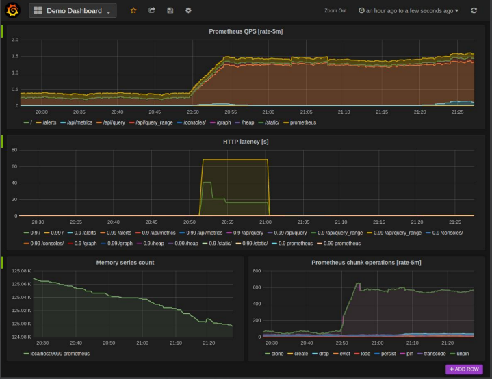
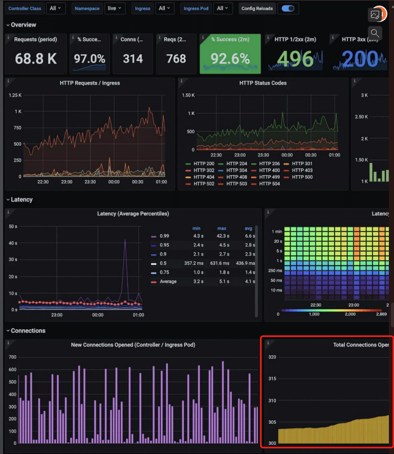
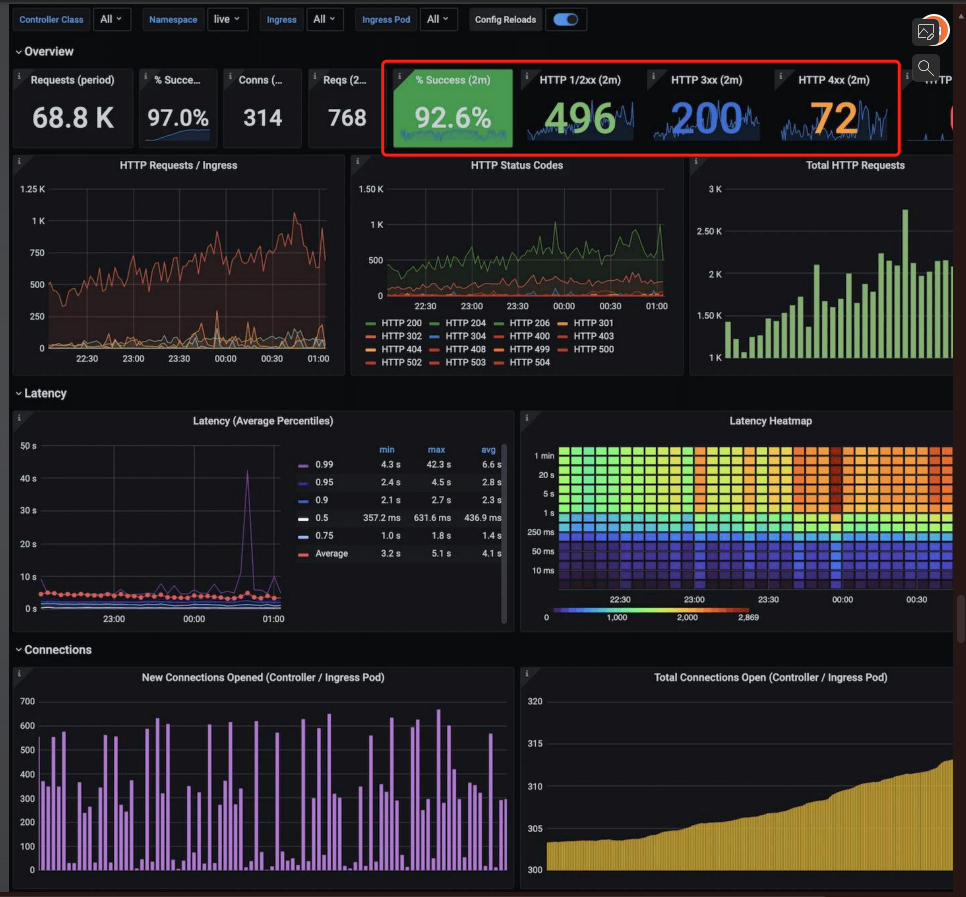
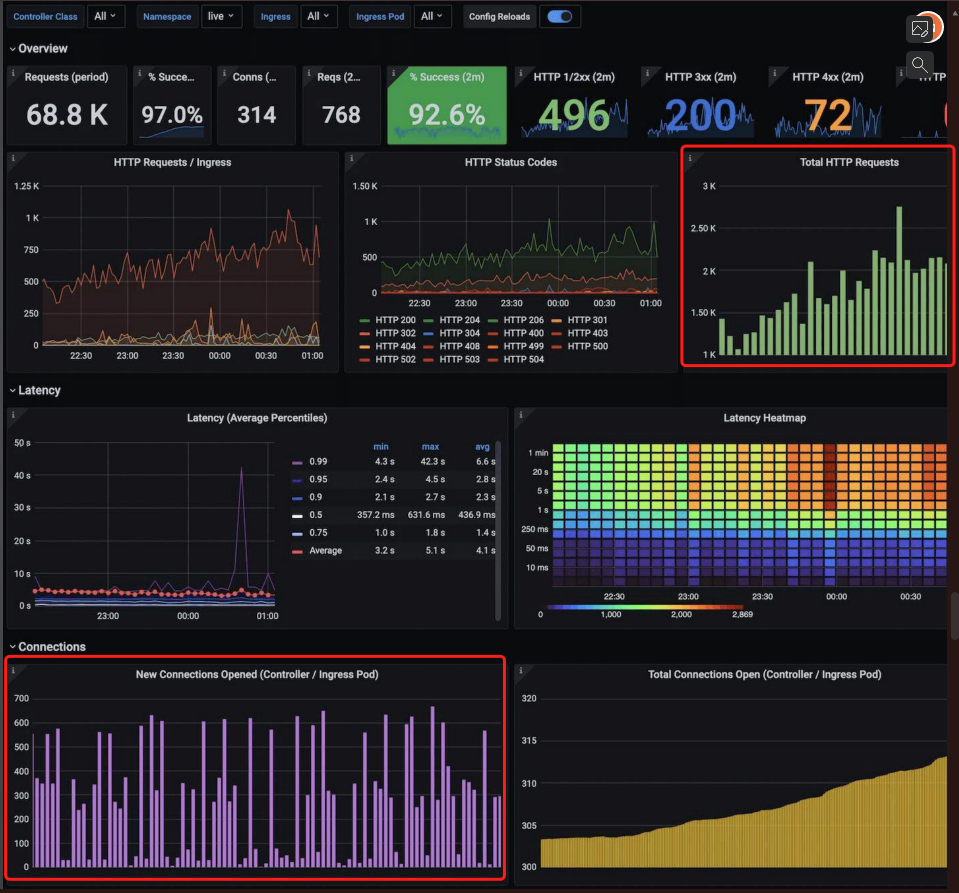
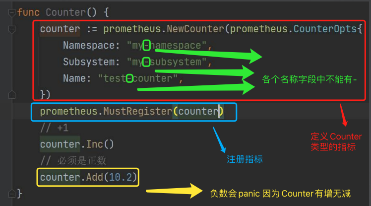
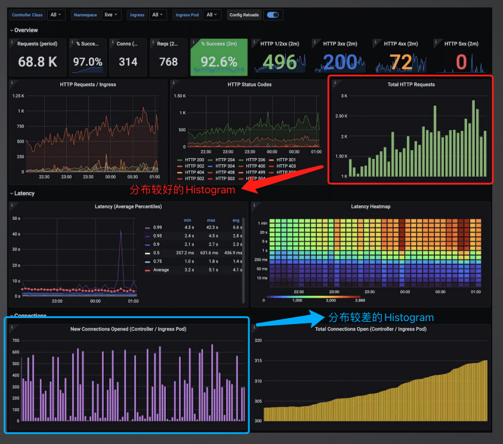
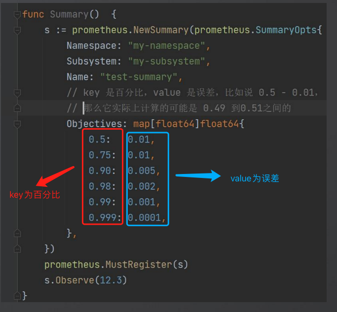

# 17. Prometheus详解

可观测性的3个关键方面:

- 日志
- 追踪
- 指标

现在就只差指标(Metrics)没有实现了

Metrics虽然很多公司内部有自研的框架,但是在开源里面,Prometheus应该算是用户最多的框架.

OpenTelemetry适配了Prometheus,但是我们可以额外提供一个Prometheus的Middleware,看看Prometheus的效果

## PART1. Metrics的类型

### 1.1 Counter

Counter:计数器,统计次数,比如说某件事发生了多少次.**Counter类型是只增不减的**,例如统计我的程序**历史总共发生panic的次数**,这种次数只会增加而不会减少(你不可能看到一你自己写的程序发生panic的共计次数越来越少)

### 1.2 Gauge

Gauge:度量,它可以增加也可以减少,比如说当前正在处理的请求数.**Gauge类型可增可减**,例如统计我的程序**当前正在处理的请求数**,这种次数随着一个请求进来就加1,随着一个请求被处理完就减1

### 1.3 Histogram

Histogram:柱状图,对观察对象进行采样,然后分到一个个桶里面

### 1.4 Summary

Summary:采样点按照百分位进行统计,比如99线、999线等

99线:99%的请求响应时间都在这条线之内.例如划定99线为1秒,则99线要求99%的请求需要在1s内能够返回

图中蓝框部分的`0.99`即为99线;`0.95`即为95线;注意`0.5`不是平均值,而是中位数;`Average`是平均线

### 1.5 Histogram和Summary的区别

在Prometheus监控系统中,Histogram和Summary都是用于跟踪事件发生的频率和大小的度量类型,但它们在功能和用法上有一些关键区别:

1. **Histogram**:
   - **分布桶(Buckets)**:Histogram通过定义一系列的桶(buckets)来测量事件的分布.每个桶覆盖了一个值的范围,并且会计数落入该范围内的事件
   - **适用性**:Histogram特别适合于**具有固定范围和需要聚合**的场景.例如请求延迟或响应大小
   - **聚合友好**:Histogram的聚合更加简单,因为它可以跨多个实例合并.这使得Histogram非常适合在高维度环境中使用,如分布式系统
   - **配置**:需要预先定义桶的范围,这可能需要根据具体应用进行调整

2. **Summary**:
   - **分位数(Quantiles)**:Summary类型计算并提供样本的分位数(quantiles),例如p50、p90、p99等。这允许你直接从度量中获取特定分位数的值。
   - **适用性**:Summary适用于需要准确分位数的场景,但通常在单个服务或应用级别使用
   - **聚合限制**:Summary的一个重要限制是**它不容易跨多个实例或作业进行聚合,因为分位数的计算通常是本地的**
   - **性能考量**:计算分位数比Histogram更为复杂和资源密集,特别是在高流量下

### 1.6 Vector

在Prometheus中,"Vector"类型是一种**数据格式(注意只是一种数据格式,或者称之为数据结构,它并不是Prometheus中的数据类型)**,它代表了一组时间序列数据.Vector类型主要分为两种:即时向量(Instant Vector)和区间向量(Range Vector).它们用于采集和表示不同类型的指标:

1. **即时向量(Instant Vector)**:
   - 这代表了在某一特定时刻的一系列时间序列数据
   - 即时向量通常用于表示瞬时的数据点,比如当前的CPU使用率、内存使用量、正在运行的进程数等
   - 在Prometheus查询中,当你查询一个特定的时间点或最新数据时,结果通常是一个即时向量

2. **区间向量(Range Vector)**:
   - 区间向量包含了一段时间内的时间序列数据
   - 它们主要用于需要观察一段时间内的趋势或模式的指标,例如过去1小时的平均负载、过去24小时内的最大网络流量等
   - 在Prometheus查询中,区间向量经常用于计算平均值、求和、最大值或最小值等,这需要对一段时间内的数据进行操作

Vector类型在Prometheus中非常核心,因为它们能够有效地表示和处理时间序列数据,这是Prometheus监控系统的基础.无论是即时数据还是一段时间内的数据,Vector类型都能够提供灵活和强大的方式来查询和分析指标

## PART2. Prometheus基本用法

### 2.1 Counter

- Namespace:APP名
- Subsystem:
	- 横向分割命名:按各个中间件划分来命名,例如HTTP、Grpc、Kafka
	- 纵向分割命名:按各个微服务划分来命名,例如user、order
	- 具体采用哪种方式,取决于你在什么地方做指标采集.如果像是在本节课中要实现的,在middleware层做指标采集,那么可能横向分割命名更合适;如果是在具体的某个服务中做指标采集,那么可能纵向分割命名更合适
- Name: 指标名称

**注意:截图中的代码有误.`Namespace`、`Subsystem`和`Name`的名称中均不能使用`-`,使用`_`代替即可.这是一个限制**

`prometheus.MustRegister()`:用于注册指标.该方法如果注册失败不会返回`error`,而是直接`panic`.注意:**对于同一个指标,如果调用`prometheus.MustRegister()`方法进行注册的话,则只能调用1次.否则会触发`panic`**

`prometheus.Register()`:用于注册指标.该方法如果注册失败会返回`error`

### 2.2 Gauge

### 2.3 Histogram

**分桶不是为了在采集指标的数值上均匀,而是为了让被采集的指标在分布上均匀**.

假定图中是针对响应时长进行分桶,那么这里的分桶就是:

- (0, 10]
- (10, 50]
- (50, 100]
- (100, 200]
- (200, 500]
- (500, 1000]
- (1000, 10000]

以上单位皆为`ms`.举个例子,可能一个请求命中了缓存,不到10ms就可以响应;没有命中缓存,走正常的业务逻辑去查库,那么大部分请求的响应时长在10-200ms之间.可以想象,直方图会呈近似正态分布的形状.500ms以上的区间就可以将粒度设置的粗一些,这样你可以在正态分布的右侧看到较多区间,且形状更接近正态分布

### 2.4 Summary

误差越小需要占用越多的CPU资源.注意**Summary是客户端计算好推给服务端的,而Histogram是客户端直接推给服务端,然后由服务端完成计算的**.因此你的误差越小,对客户端的系统性能影响就越大.

那么为什么会有误差呢?这里我们还是以请求响应时长为例:如果你有100个请求,统计99%的请求的响应时间,那么你可以统计99个请求的响应时长;那么如果你有101个请求,你是没法统计99.01个请求的响应时长的,因此有一个误差区间

### 2.5 Vector

- ConstLabels:固定的标签.即指标中的每一份数据都会有这些标签
- Labels:动态设定的标签

那么为什么要动态设定标签呢? 直接把标签在ConstLabels中全都预定义好不就可以了吗?

按图中的例子,如果为`/user/:id`、`POST`、`200`预定义一组标签,那么`/user/:id`、`POST`、`201`是不是还要预定义一组标签?

注意`WithLabelValues()`返回的是一个Summary,而非是Vector.再次注意,Summary是一种数据类型,而Vector只是一种数据结构,这里只是Vector中包含了多个Summary,类似于一个[]int中包含了多个int一样.

`WithLabelValues("/user/:id", "POST", "200")`:如果没有标签和给定值相同的Summary则创建,如果有则返回该Summary.

`Observe(128)`:写入Summary统计的指标数据